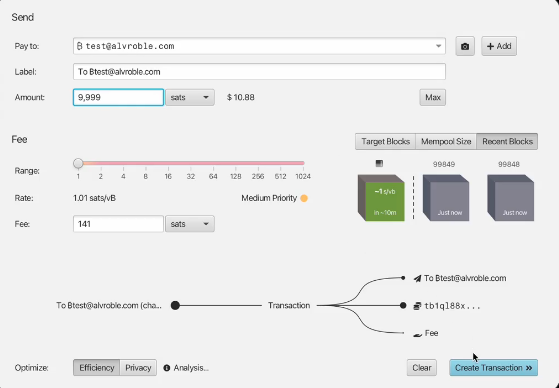
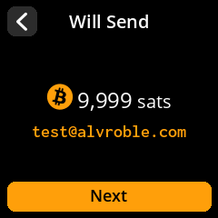
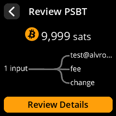
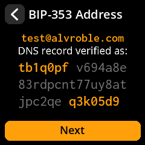
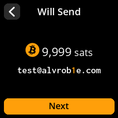
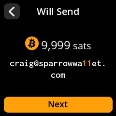
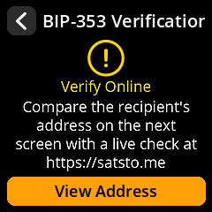

+++
title = "SeedSigner + BIP-353: pagos de Bitcoin con nombres legibles"
date = "2025-10-02"
draft = false
categories = ["Desarrollo"]
tags = ["bitcoin", "seedsigner", "ux", "security"]
description = "SeedSigner + BIP-353: pagos de Bitcoin con nombres legibles"
+++

El sistema de direcciones de Bitcoin siempre ha planteado una paradoja. Por un lado, las direcciones están diseñadas para ser eficientes y compactas; por otro, su codificación opaca hace que resulte casi imposible utilizarlas directamente sin recurrir a copiar y pegar o a códigos QR. Esta carencia de usabilidad ha impulsado durante años propuestas para añadir una capa legible a los pagos de Bitcoin. Desde las URI de BIP-21/BIP-321 hasta el protocolo de pagos de BIP-70, y más recientemente LNURL y Lightning Address, la comunidad ha seguido experimentando para conciliar la interacción humana con la corrección criptográfica.

[BIP-353, «DNS Payment Instructions»](https://github.com/bitcoin/bips/blob/master/bip-0353.mediawiki) es el siguiente paso en esta trayectoria. Propone aprovechar la infraestructura DNS existente —en concreto, los registros protegidos con DNSSEC— como sistema de nombres y autenticación de alcance mundial para las instrucciones de pago de Bitcoin. El resultado es la posibilidad de resolver un nombre legible para las personas (HRN), como alice@example.com, y obtener una solicitud de pago de Bitcoin válida, respaldada por pruebas criptográficas en lugar de depender únicamente de la confianza en un servidor DNS.

Para los monederos de software conectados a la red, integrar BIP-353 es relativamente sencillo: resolver los registros DNS, verificar DNSSEC, analizar la instrucción de pago y continuar. Pero el reto se vuelve más interesante al considerar los monederos físicos, especialmente los aislados de la red, como **[SeedSigner](https://seedsigner.com/)**.

❓ <strong>Pregunta clave:</strong> ¿Cómo puede un dispositivo con recursos limitados y sin acceso directo a la red participar en este proceso de resolución y, al mismo tiempo, ofrecer al usuario garantías sólidas sobre la autenticidad de las instrucciones de pago?

Este artículo explora esa pregunta. Primero examinaremos el diseño de BIP-353; después revisaremos su implementación en [embit](https://github.com/diybitcoinhardware/embit), la biblioteca que utiliza SeedSigner; y, por último, analizaremos los retos de arquitectura y experiencia de usuario que plantea llevar las instrucciones de pago por DNS a un monedero físico. También consideraremos distintas formas de presentar estas pruebas al usuario y de equilibrar seguridad y usabilidad.

📝 <strong>Nota sobre los tipos de dirección:</strong> Aunque BIP-353 funciona de forma óptima con esquemas reutilizables como <strong>Silent Payments</strong>, este artículo se centra en las direcciones habituales de Bitcoin, que no deben reutilizarse. El motivo es que SeedSigner y embit todavía no admiten direcciones de Silent Payments en el contexto descrito en este artículo. A medida que su implementación madure en los monederos físicos, BIP-353 tendrá aún más potencial para ofrecer pagos con nombres legibles que preserven la privacidad.

# Contexto

## El problema de utilizar las direcciones directamente

Las direcciones de Bitcoin, tanto en base58 como en bech32, resultan poco amigables para las personas. Son cadenas largas, de apariencia aleatoria y sin significado semántico. Un solo error de transcripción puede invalidarlas o, en el peor caso, desviar los fondos a un destino equivocado. Los monederos han mitigado este problema mediante códigos QR, agendas de direcciones y la función de copiar y pegar, pero son soluciones parciales.

El problema de fondo es que las direcciones no expresan identidad ni intención. Un usuario no puede saber con solo mirarla quién controla bc1qxy2kgdygjrsqtzr3n0yrf243p83kkfj2hx0wlh. Esta falta de significado obliga a utilizar un canal de comunicación separado del propio pago para indicar «a quién estás pagando».

## Intentos anteriores de hacer los pagos legibles

Varios estándares y protocolos han tratado de reducir esta distancia:

- **BIP-21 (URI de Bitcoin)**: permite codificar importes, etiquetas y mensajes en una URI. Es útil, pero el usuario sigue necesitando obtener esa URI de forma segura.
- **BIP-70 (protocolo de pagos)**: buscaba ofrecer solicitudes de pago autenticadas mediante HTTPS. Resolvía muchos problemas de experiencia de usuario, pero introducía nuevas dependencias de confianza en las autoridades de certificación (CA) y una mayor complejidad de implementación, lo que contribuyó a su declive.
- **Lightning Address / LNURL**: en el ecosistema Lightning, los identificadores legibles como user@domain.com permiten obtener solicitudes de pago (invoices) o acceder a servicios web (endpoints). Han ganado aceptación porque la velocidad y la frecuencia de los pagos de Lightning exigían una mejor experiencia. Sin embargo, dependen de HTTPS y de servidores web, no de pruebas DNSSEC.

Todas estas soluciones mejoraron la usabilidad, pero tuvieron una adopción limitada o introdujeron nuevas dependencias de confianza.

## DNS y DNSSEC como capa de nombres

DNS ya es el espacio de nombres de referencia de Internet. Los principales servicios, plataformas de intercambio y comercios de Bitcoin poseen dominios, a menudo con DNSSEC desplegado. DNSSEC proporciona una cadena de firmas criptográficas desde la zona raíz hasta el dominio, lo que permite verificar que un registro DNS fue publicado por el propietario del dominio y no fue alterado durante su transmisión.

BIP-353 aprovecha esta propiedad: las instrucciones de pago se publican en registros DNS TXT bajo el control del propietario del dominio. Un monedero puede consultar DNS, obtener el registro TXT y verificar las pruebas DNSSEC asociadas. Si la prueba es válida, puede confiar en que alice@example.com está asociado a los datos de pago indicados.

DNSSEC aporta autenticidad criptográfica a la asociación entre un dominio y la instrucción de pago que publica. El modelo pasa de «confía en tu resolutor recursivo o servidor HTTPS» a «confía en la cadena de confianza DNSSEC anclada en la zona raíz». Sigue habiendo terceros implicados —registradores, operadores de dominios de nivel superior y responsables de las claves raíz—, pero las garantías son verificables, permiten almacenar las pruebas en caché y resisten ataques de intermediario (MITM). A diferencia de HTTPS, donde las CA pueden emitir certificados, a veces [sin que se detecte](https://bugzilla.mozilla.org/show_bug.cgi?id=1883843#c10), las pruebas DNSSEC pueden validarse sin conexión y están vinculadas explícitamente a la raíz criptográfica de DNS, mediante las anclas de confianza controladas por IANA.

### De DNS a Bitcoin: el puente

En esencia, BIP-353 propone lo siguiente:

- Un nombre legible para las personas (HRN) se asocia a un registro DNS TXT que contiene una URI de Bitcoin conforme a BIP-21/BIP-321.
- El registro TXT se autentica mediante pruebas DNSSEC.
- El monedero se encarga de resolver el HRN, validar la prueba DNSSEC, analizar la URI y presentar al usuario los datos del pago.

Este diseño ofrece una capa de nombres mínima y globalmente interoperable para Bitcoin, sin introducir infraestructura nueva. Reutiliza lo que ya está desplegado a gran escala y lo combina con las URI de Bitcoin existentes.

# Especificación de BIP-353

BIP-353 es una capa ligera de resolución y autenticación que conecta los nombres legibles con la semántica existente de las URI de Bitcoin (BIP-21). La propuesta se puede entender a través de tres componentes:

**Nombre legible para las personas (HRN)**
- Un nombre como alice@example.com es el punto de entrada.
- El HRN combina un usuario y un dominio. Para alice@example.com, el nombre DNS consultado es alice.user._bitcoin-payment.example.com. Se utiliza el sistema DNS existente.

**Registros de instrucciones de pago**
- Los datos de pago se publican en un registro DNS TXT bajo el nombre DNS derivado del HRN.
- Cada registro TXT contiene una URI BIP-21/BIP-321, por ejemplo bitcoin:bc1q…?amount=0.01&label=Donation.
- Los campos opcionales, como el importe, la etiqueta y el mensaje, se conservan exactamente como en BIP-21/BIP-321.
- Puede haber otros registros TXT bajo el mismo nombre, pero solo uno puede comenzar por `bitcoin:` (sin distinguir mayúsculas y minúsculas). Si hay varios que coincidan, las instrucciones de pago se consideran inválidas.

**Pruebas DNSSEC**
- La autenticidad del registro TXT se establece mediante pruebas DNSSEC.
- Una cadena válida de registros firmados debe conectar el HRN consultado con la zona raíz de DNS.
- Los monederos deben tratar una prueba ausente o inválida como un error que impide continuar, no como una mera advertencia.

## Modelo de seguridad

- **Garantías**. La asociación HRN → registro TXT se autentica criptográficamente.
- **Dependencias**. Sigue dependiendo de las anclas de confianza de DNSSEC, los operadores de dominios de nivel superior y los registradores.
- **Verificación**. Las pruebas se pueden almacenar en caché y validar sin conexión, por lo que son compatibles con monederos físicos que no consultan DNS directamente.

Más detalles en el [BIP oficial](https://github.com/bitcoin/bips/blob/master/bip-0353.mediawiki).

# Integración de embit + SeedSigner + BIP-353

A continuación explico cómo se incorporó el trabajo sobre BIP-353 a embit, por qué se implementó de esa forma y sus implicaciones prácticas para los monederos físicos que utilizan embit como biblioteca de Bitcoin, como [Krux](https://github.com/selfcustody/krux) y [SpecterDIY](https://github.com/cryptoadvance/specter-diy).

## Resumen y puntos clave

La pull request implementa la compatibilidad con BIP-353 en embit mediante tres cambios: (1) añade un campo por salida de PSBT para las pruebas DNSSEC de RFC-9102; (2) incorpora el análisis de URI BIP-21/BIP-321 a partir de registros TXT; y (3) integra el generador y validador de pruebas [dnssec-prover](https://github.com/TheBlueMatt/dnssec-prover) de TheBlueMatt, escrito en Rust, mediante un binario e interfaces de integración con Python (bindings) generadas con uniffi, para que embit pueda verificar cadenas de autenticación RFC-9102 sin conexión.

El enfoque está centrado en la verificación sin conexión: las pruebas se generan en una máquina conectada a la red, o mediante una herramienta con DNS sobre HTTPS (DoH), se adjuntan a la PSBT y se trasladan al firmante. Este puede validar la prueba sin realizar consultas DNS. Es precisamente lo que contempla BIP-353: pruebas RFC-9102 dentro de una PSBT.

## Arquitectura general y flujo de uso

(1) **Generación de la prueba (herramienta conectada)**: el coordinador del monedero, en una máquina conectada, consulta DNS/DNSSEC y construye una prueba AuthenticationChain de RFC-9102 para user.user._bitcoin-payment.domain, según describe BIP-353. La prueba es un bloque binario serializable que representa la cadena DNSSEC completa necesaria para validar los registros TXT.

Un ejemplo real en Sparrow Wallet:

(2) **Inclusión en la PSBT**: el coordinador escribe la prueba en el campo por salida PSBT_OUT_DNSSEC_PROOF, con el formato: un byte que indica la longitud del HRN + el HRN sin el prefijo ₿ + la prueba DNSSEC en formato RFC-9102. La PSBT también contiene las salidas y los importes habituales.

(3) **Transferencia al firmante**: la PSBT, que ya contiene la prueba, se traslada al firmante aislado de la red; en SeedSigner, mediante QR.

(4) **Validación en el firmante (sin conexión)**: embit lee la PSBT en el monedero físico, localiza PSBT_OUT_DNSSEC_PROOF y llama a verify_dns_proof() para validar la cadena RFC-9102 y extraer los registros TXT. Después filtra estos registros conforme a las reglas de BIP-353: ignora las entradas que no comienzan por bitcoin: y considera inválida la presencia de varios registros TXT bitcoin: bajo la misma etiqueta. Si la validación es correcta y el TXT contiene una URI BIP-21/BIP-321, embit puede analizarla y presentar el nombre canónico ₿user@domain junto con la dirección y el importe subyacentes.

El firmante muestra al usuario tanto el HRN canónico, ₿user@domain, como la dirección de Bitcoin y el importe.

Después debe realizarse la verificación explícita:

Este diseño separa la obtención de la prueba, con conexión, de su verificación, sin conexión, para impedir que un monedero comprometido sustituya destinos de forma silenciosa. Incluso si Sparrow actuara de forma maliciosa e intentara sustituir la dirección prevista, SeedSigner valida por su cuenta la prueba DNSSEC antes de mostrar el destinatario.

# Preguntas abiertas y compromisos de diseño

### Integración con Rust o adaptación a Python

La pull request depende actualmente de binarios de dnssec-prover en Rust con interfaces de integración para Python mediante uniffi. Es una solución robusta y ya auditada, pero resulta incómoda para dispositivos muy limitados que intentan evitar dependencias nativas. Además, aunque se puede mantener la reproducibilidad, combinar plataformas y verificaciones manuales separadas añade fricción para los usuarios de esta biblioteca: los desarrolladores de monederos físicos.

Para abordar esta cuestión creé una adaptación íntegramente en Python, [pydnssec-prover](https://github.com/alvroble/pydnssec-prover), pero es más reciente y todavía no está suficientemente probada en condiciones reales.

Por tanto, hay que decidir entre adoptar como estándar el verificador de Rust, más robusto pero más pesado, o invertir en madurar la versión de Python para que sea lo bastante fiable para su uso a largo plazo en hardware mínimo con MicroPython.

### Tamaño de la PSBT

Las pruebas DNSSEC pueden ser enormes —decenas de kilobytes— en comparación con el tamaño habitual de una PSBT. BIP-353 utiliza deliberadamente la PSBT como «contenedor de pruebas». Para SeedSigner, que ya maneja códigos QR grandes divididos en varias partes, esto no supone un impedimento práctico, sino una consideración de usabilidad: algunos fotogramas QR más y una carga algo más lenta.

### Fechas de validez de las firmas y validación sin conexión

Las firmas RRSIG incluidas en las pruebas DNSSEC tienen fechas de inicio y de fin de validez. Normalmente, un monedero comprueba que la prueba es válida «ahora». Pero SeedSigner no tiene reloj en tiempo real y el retraso entre la incorporación de la prueba por el coordinador y la firma en el monedero físico puede ser indefinido. Esto plantea una pregunta: _¿qué ocurre si una prueba válida al crear la PSBT caduca antes de que el usuario firme?_

- Una prueba válida al crear la PSBT podría caducar antes de la firma.
- El firmante no puede detectar por sí solo la caducidad.
- Un monedero comprometido podría insertar un HRN malicioso con una prueba a punto de caducar, y el firmante seguiría aceptándola mucho después de su vencimiento.

**Esta tensión del modelo sigue sin resolverse.**

Algunos sostienen —véase el [debate entre Keith Mukai y Matt Corallo en X](https://x.com/KeithMukai/status/1961838842924630301)— que la vigencia es menos importante que la corrección: una prueba valida la asociación HRN → URI en un momento determinado, aunque caduque después. Otros responden que aceptar pruebas caducadas debilita las garantías de seguridad: un ordenador comprometido podría incluir un HRN malicioso con una prueba todavía válida en ese momento, y el firmante seguiría aceptándola mucho después de que caducase.

> **Aclaración de la revisión del 6 de octubre de 2026:** las opciones siguientes recogen el debate de diseño del artículo. La [especificación vigente de BIP-353](https://github.com/bitcoin/bips/blob/master/bip-0353.mediawiki) exige comprobar las fechas de inicio y caducidad de todas las firmas RRSIG. Solo permite tolerar hasta una hora desde la caducidad cuando es previsible un retraso entre la creación de la PSBT y la firma. Por tanto, ignorar la vigencia temporal no cumple la especificación vigente.

Las opciones de diseño planteadas para SeedSigner incluían:

- **Validación exclusivamente criptográfica**. Validar la cadena sin exigir estrictamente que esté vigente, dado que no tiene reloj, aunque se podría mostrar el intervalo de validez al usuario.
- **Mostrar los intervalos de validez**. Presentarlos en la interfaz para que el usuario sepa que podría estar firmando con datos caducados.
- **Responsabilidad del coordinador**. Los monederos conectados deben comprobar la validez respecto a la hora actual antes de construir la PSBT.
- **Protecciones en la interfaz**. La coherencia de las tipografías, el uso de mayúsculas y minúsculas y el resaltado del HRN ayudan a reducir los riesgos de suplantación y de nombres visualmente parecidos.

- **Verificación externa**. También podría recomendarse una verificación independiente desde la propia interfaz, remitiendo a un verificador DNSSEC externo, como [satsto.me](https://satsto.me/).

Esto puede aportar redundancia, pero tiene límites: un programa malicioso podría manipular tanto la PSBT como el sitio de verificación, y la comparación manual es tediosa. Una opción más sencilla, como confirmar la fecha actual al mostrar los intervalos de validez, ofrece una seguridad similar con menos fricción. Las comprobaciones de terceros pueden ser útiles para operaciones de gran valor, pero deberían seguir siendo opcionales.

# Conclusión

BIP-353 representa una evolución natural en el esfuerzo de Bitcoin por conciliar la criptografía con la experiencia de usuario. Al respaldar las instrucciones de pago con pruebas DNSSEC, transforma direcciones opacas en nombres legibles y verificables que pueden comprobarse sin conexión, sin introducir infraestructura nueva. Los monederos físicos con recursos limitados y aislados de la red deben ofrecer garantías de seguridad sólidas con supuestos mínimos sobre el tiempo, la red y la confianza.

La integración en SeedSigner y embit demuestra que esto es posible y práctico: las pruebas se pueden generar con conexión, transportar mediante PSBT y verificar sin conexión de forma reproducible. Sin embargo, quedan decisiones importantes: cómo manejar el tamaño de las pruebas, si utilizar interfaces de integración con Rust o verificadores escritos íntegramente en Python y cómo comunicar los intervalos de validez de DNSSEC sin confundir ni sobrecargar al usuario. Son problemas abordables, pero exigen decisiones de diseño cuidadosas que equilibren el rigor técnico con la experiencia de uso real.

En una perspectiva más amplia, BIP-353 acerca los pagos de Bitcoin a una experiencia segura e intuitiva: los usuarios pueden pagar a ₿alice@example.com con confianza criptográfica. El trabajo pendiente consiste en perfeccionar su despliegue para que los usuarios cotidianos, incluso con los dispositivos más limitados, puedan utilizarlo de forma segura. Si la comunidad resuelve estas cuestiones, BIP-353 podría ofrecer lo que las propuestas anteriores no lograron: una capa de nombres para Bitcoin sencilla, universal y con seguridad verificable.

# Referencias

- [BIP-353](https://github.com/bitcoin/bips/blob/master/bip-0353.mediawiki)
- [Pull request de BIP-353 en embit](https://github.com/diybitcoinhardware/embit/pull/102)
- [dnssec-prover de TheBlueMatt](https://github.com/TheBlueMatt/dnssec-prover)
- [Hilo de Keith Mukai](https://x.com/KeithMukai/status/1961838821504352498)
- [Rama BIP-353 de SeedSigner de Keith Mukai](https://github.com/kdmukai/seedsigner/tree/bip353)

Agradecimientos a [@kdmukai](https://github.com/kdmukai/), [@TheBlueMatt](https://github.com/TheBlueMatt), [@notTanveer](https://github.com/notTanveer) y [B4OS.dev](https://b4os.dev/), entre otros <3
