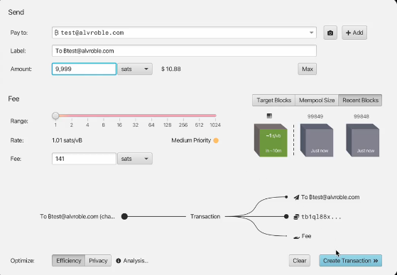
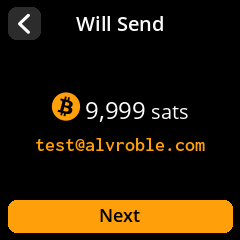
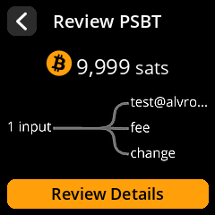
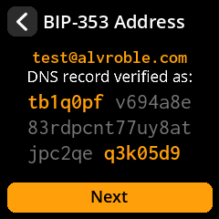
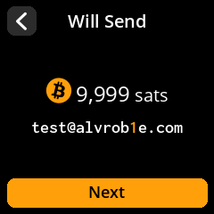
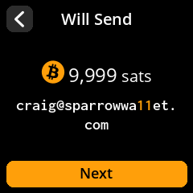
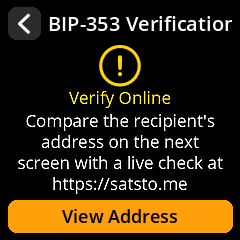

+++
title = "SeedSigner + BIP-353: Human-Readable Bitcoin Payments"
date = "2025-10-02"
draft = false
categories = ["Development"]
tags = ["bitcoin", "seedsigner", "ux", "security"]
description = "SeedSigner + BIP-353: Human-Readable Bitcoin Payments"
+++

Bitcoin’s address system has always presented a paradox. On one hand, addresses are designed for efficiency and compactness; on the other, their opaque encoding makes them nearly impossible to use directly without relying on copy-paste or QR codes. This usability gap has fueled proposals over the years to give Bitcoin payments a human-readable layer. From BIP-21/BIP-321 URIs to BIP-70’s payment protocol, and more recently LNURL and Lightning Address, the community has continued to experiment with bridging human interaction and cryptographic correctness.

[BIP-353 “DNS Payment Instructions”](https://github.com/bitcoin/bips/blob/master/bip-0353.mediawiki) is the latest step in this trajectory. It proposes a method to leverage the existing DNS infrastructure (specifically DNSSEC-secured records) as a globally deployed naming and authentication system for Bitcoin payment instructions. The result is the possibility to use a human-readable name (HRN), like alice.example.com, to resolve to a valid Bitcoin payment request, secured by cryptographic proofs rather than simple trust in a DNS server.

For software wallets with network connectivity, integration of BIP-353 is relatively straightforward: resolve DNS records, verify DNSSEC, parse the payment instruction, and proceed. But the challenge becomes more interesting when we consider hardware wallets, especially air-gapped ones like **[SeedSigner](https://seedsigner.com/)**. 

❓ <strong>Key Question:</strong> How can a constrained device, with no direct network access, participate in this resolution process while still ensuring the user gets strong assurances about the authenticity of the payment instructions?

This article explores that question. We will first examine the design of BIP-353, then review its implementation in [embit](https://github.com/diybitcoinhardware/embit) (the library underlying SeedSigner) and finally analyze the architectural and UX challenges of bringing DNS Payment Instructions to a hardware wallet environment. Along the way, we’ll also consider alternative approaches to presenting these proofs to the user and balancing security with usability.

# Background

## The Problem with Raw Addresses 

Bitcoin addresses, whether in base58 or bech32, are hostile to human interaction. They are long, random-looking strings with no semantic meaning. Even a single transcription error renders them invalid or, worse, redirects funds to the wrong destination. Wallets have mitigated this problem by relying on QR codes, address books, or copy-paste, but these are at best workarounds.

The deeper issue is that addresses do not map to identity or intent. A user cannot tell by inspection who controls bc1qxy2kgdygjrsqtzr3n0yrf243p83kkfj2hx0wlh. This lack of semantics means payments always require an out-of-band communication channel to convey “who you are paying”.

## Prior Attempts at Human-Readable Payments

Several standards and protocols have tried to smooth over this gap:

- **BIP-21 (Bitcoin URIs)**: allows encoding amounts, labels, and messages in a URI format. While helpful, the user still needs to obtain the URI securely.

- **BIP-70 (Payment Protocol)**: aimed to provide authenticated payment requests over HTTPS. It solved many UX problems but introduced new trust assumptions on CAs and implementation complexity, leading to its decline.

- **Lightning Address / LNURL**: in the Lightning ecosystem, human-readable identifiers like user@domain.com resolve to invoices or endpoints. These have gained traction in Lightning because the speed and frequency of payments demanded better UX. However, they rely on HTTPS and web servers, not DNSSEC proofs.

Each of these solutions improved usability but either fell short on adoption or introduced new trust dependencies.

## DNS and DNSSEC as a Naming Layer

DNS is already the Internet’s canonical namespace. Every major Bitcoin service, exchange, and merchant owns domains, often with DNSSEC deployed. DNSSEC provides a chain of cryptographic signatures from the root zone down to the domain, enabling clients to verify that a DNS record was indeed published by the domain owner and not tampered with in transit.

BIP-353 leverages this: payment instructions are published in DNS TXT records under the control of the domain owner. A wallet can query the DNS, fetch the TXT record, and verify the associated DNSSEC proofs. If the proof is valid, the wallet can trust that alice.example.com is indeed associated with the payment details specified.

Crucially, DNSSEC provides cryptographic authenticity for the mapping between a domain and its published payment instruction. The trust model shifts away from “trust your recursive resolver or HTTPS server” toward “trust the DNSSEC chain of trust anchored in the root zone.” This still involves third parties (registrars, TLD operators, and the root key maintainers) but the guarantees are verifiable, cacheable, and resistant to MITM attacks. Unlike HTTPS, where CAs can (sometimes [silently](https://bugzilla.mozilla.org/show_bug.cgi?id=1883843#c10)) issue certificates, DNSSEC proofs can be validated offline and are explicitly tied to the cryptographic root of DNS (the trust anchors controlled by IANA).

### From DNS to Bitcoin: the bridge

At its core, BIP-353 proposes that:

- A human-readable name (HRN) maps to a DNS TXT record containing a Bitcoin URI (per BIP-21/BIP-321).
- The TXT record is authenticated using DNSSEC proofs.
- The wallet, not the user, performs the heavy lifting of resolving the HRN, validating the DNSSEC proof, parsing the Bitcoin URI, and presenting the payment details to the user.

This design provides a minimal but globally interoperable naming layer for Bitcoin, without introducing new infrastructure. It reuses what is already deployed at scale and combines it with existing Bitcoin URI.

# BIP-353 Specification

BIP-353 is a thin resolution and authentication layer that connects human-readable names to existing Bitcoin URI semantics (BIP-21). The proposal can be understood in three components:

**Human-Readable Name (HRN)**
- A name such as alice.example.com is the entry point.
- The HRN is simply a DNS label, not a new naming system.

**Payment Instruction Records**
- Payment details are published as DNS TXT records under the HRN.
- Each TXT record contains a BIP-21/BIP-321 URI (e.g. bitcoin:bc1q…?amount=0.01&label=Donation).
- Optional fields like amount, label, and message are preserved exactly as in BIP-21/BIP-321.
- Multiple TXT records can exist, letting a domain owner offer multiple payment options.

**DNSSEC Proofs**
- The authenticity of the TXT record is established via DNSSEC proofs.
- A valid chain of signed records must link from the queried HRN back to the DNS root zone.
- Wallets should treat a missing or invalid proof as a hard failure, not a warning.

## Security Model

- **Guarantees**. The mapping from HRN → TXT record is authenticated cryptographically.
- **Reliance**. Still depends on DNSSEC’s trust anchors, TLD operators, and registrars.
- **Verification**. Proofs can be cached and validated offline, making them compatible with hardware wallets that do not query DNS directly.

More details on the [official BIP](https://github.com/bitcoin/bips/blob/master/bip-0353.mediawiki)

# Embit + SeedSigner + BIP-353 Integration

Below I lay out how the BIP-353 work landed in embit, why it was implemented the way it was, and the practical implications for hardware wallets that use embit as their Bitcoin toolkit (such as [Krux](https://github.com/selfcustody/krux) and [SpecterDIY](https://github.com/cryptoadvance/specter-diy)).

## Short summary / takeaways

The PR implements BIP-353 support in embit by (1) adding a PSBT output field for RFC-9102 DNSSEC proofs, (2) adding parsing of BIP-21/BIP-321 URIs from TXT records, and (3) integrating the TheBlueMatt's [dnssec-prover](https://github.com/TheBlueMatt/dnssec-prover) proof generator/validator (Rust) as a binary/uniffi binding so embit can verify RFC-9102 authentication chains offline. 

The approach is explicitly about offline verification: proof material is created by an online machine (or a DoH-enabled helper), attached to the PSBT, and carried to the signer. The signer can validate the proof without performing DNS lookups itself. That is exactly what BIP-353 anticipates (RFC-9102 proofs in PSBT). 

## High-level architecture / UX runtime flow

(1) **Proof generation (online helper)**: the wallet coordinator within an online machine queries DNS/DNSSEC and builds an RFC-9102 AuthenticationChain proof for user.user._bitcoin-payment.domain (as BIP-353 specifies). The proof is a serializable binary blob representing the full DNSSEC chain needed to validate the TXT RR(s).

Here a real-life example from Sparrow Wallet:

(2) **Embed in PSBT**: the coordinator software writes the proof into the PSBT per-output field PSBT_OUT_DNSSEC_PROOF (format: 1-byte len + HRN string + RFC-9102 proof payload). The PSBT also contains outputs/amounts as usual.

(3) **Transfer to signer**: the PSBT (now carrying the proof) is moved to the air-gapped signer (in SeedSigner's case by QR).

(4) **Signer validation (offline)**: on the hardware wallet, embit reads the PSBT, locates PSBT_OUT_DNSSEC_PROOF, and calls verify_dns_proof() to validate the RFC-9102 chain and to extract TXT records. Embit then filters the TXT records per BIP-353 rules (ignore non-bitcoin: entries; treat multiple bitcoin: TXT records at the same label as invalid). If validation passes and the TXT contains a BIP-21/BIP-321 URI, embit can parse it and present the canonical ₿user@domain and the underlying address/amount to the user.

  The signer then presents both the canonical HRN (₿user@domain) and the underlying Bitcoin address/amount to the user.

  

  
  
  

  Afterwards, verification should explicitly happen:

  

  
  

This design decouples proof retrieval (online) from proof verification (offline), ensuring that a compromised wallet cannot silently substitute destinations. Even if Sparrow were “evil” and attempted to replace the intended address, SeedSigner independently validates the DNSSEC proof before displaying the recipient.

# Open questions and tradeoffs

### Bindings vs Porting

The PR currently relies on Rust dnssec-prover binaries with Python bindings (uniffi). This is robust and already audited, but awkward for highly constrained devices that try to avoid native dependencies. Also, although reproducibility can be maintained, mixing platforms and separate manual attestations are always added friction for the users (which are the developers of hardware wallets). 

I created for this matter a pure-Python port [pydnssec-prover](https://github.com/alvroble/pydnssec-prover) but is newer and not battle-tested. 

So it should be decided whether to standardize around the more robust but heavier Rust-based prover, or to invest in maturing the Python port so that it becomes reliable enough for long-term use on minimal hardware running MicroPython.

### PSBT Size

DNSSEC proofs can be huge (tens of kilobytes) vs the typical PSBT size. BIP-353 intentionally uses PSBT as a “proof container.” For SeedSigner, which already handles large multipart QR codes, this isn’t actually a practical blocker, just a UX consideration (slightly more QR frames, slightly slower load).

### Signature Timestamps & Offline Validation

DNSSEC proofs contain RRSIG validity windows. Normally, a wallet checks that the proof is valid “now”. But SeedSigner has no real-time clock, and there may be a potentially unlimited delay between when the wallet coordinator adds the proof and when the hardware wallet actually signs. This raises an important question: _what happens if a proof that was valid at the time of PSBT creation expires before the user eventually signs?_
- A proof valid at PSBT creation might expire before signing.
- The signer cannot independently detect expiration.
- A compromised wallet could insert a malicious HRN with a barely-valid proof, and the signer would still accept it long after expiry.

**This is an unresolved tension in the model**. 

Some argue (see [Keith Mukai & Matt Corallo debate on X](https://x.com/KeithMukai/status/1961838842924630301)) that freshness is less important than correctness: a proof validates the binding HRN → URI at a point in time, even if it later expires. Others counter that allowing stale proofs weakens security guarantees: a compromised desktop could embed a malicious HRN with a just-valid proof, and the signer would still accept it long after expiry.

For SeedSigner, the pragmatic choice may be:

- **Cryptographic validation only**. SeedSigner validates the chain cryptographically, ignoring strict freshness (since it has no clock), although validity range could be shown to the user.
- **Surface validity ranges**. Display the proof’s validity window in the UI, so users understand they may be signing against stale data.
- **Coordinator responsibility**. Online wallets should enforce validity checks against the current time before constructing a PSBT.  
- **UX-level safeguards**. Consistent fonts, casing, and HRN highlighting help reduce lookalike/phishing risks.

- **External Verification**: At some point, it could also be proposed as a recommendation to do your own external verification within the UX itself, pointing to an external DNSSEC verifier (e.g. [satsto.me](https://satsto.me/)).

  While this can add redundancy, it has limits: malware could tamper with both the PSBT and the verification site, and manual comparison is tedious. A simpler approach—such as confirming the current date when showing validity ranges—offers similar security with less friction. Third-party checks may be useful for high-value cases but should remain optional.

# Conclusion
This work implements the practical mechanism BIP-353 envisioned: transferable RFC-9102 proofs carried in PSBTs, validated offline on constrained signers. The main engineering tradeoffs are packaging (dnssec-prover native bindings vs Python port), PSBT size, and additional QA for small MicroPython hardware. The PR authors already included reproducible build steps, test vectors (Sparrow), and reviewer feedback from key actors; that puts embit in a strong position to be the canonical verification library for SeedSigner-style hardware wallets. 

# References
- [BIP-353](https://github.com/bitcoin/bips/blob/master/bip-0353.mediawiki)
- Embit [BIP-353 PR](https://github.com/diybitcoinhardware/embit/pull/102)
- TheBlueMatt's [dnssec-prover](https://github.com/TheBlueMatt/dnssec-prover)
- Keith Mukai's [thread](https://x.com/KeithMukai/status/1961838821504352498)
- Keith Mukai's [BIP-353 SeedSigner branch](https://github.com/kdmukai/seedsigner/tree/bip353)

s/o to [@kdmukai](https://github.com/kdmukai/), [@TheBlueMatt](https://github.com/TheBlueMatt), [@notTanveer](https://github.com/notTanveer), [B4OS.dev](https://b4os.dev/) among others <3