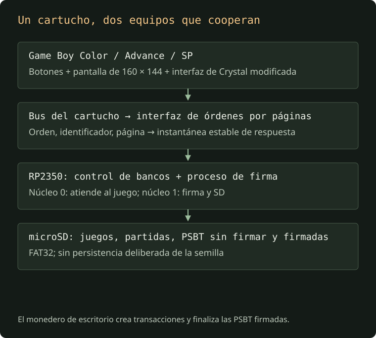
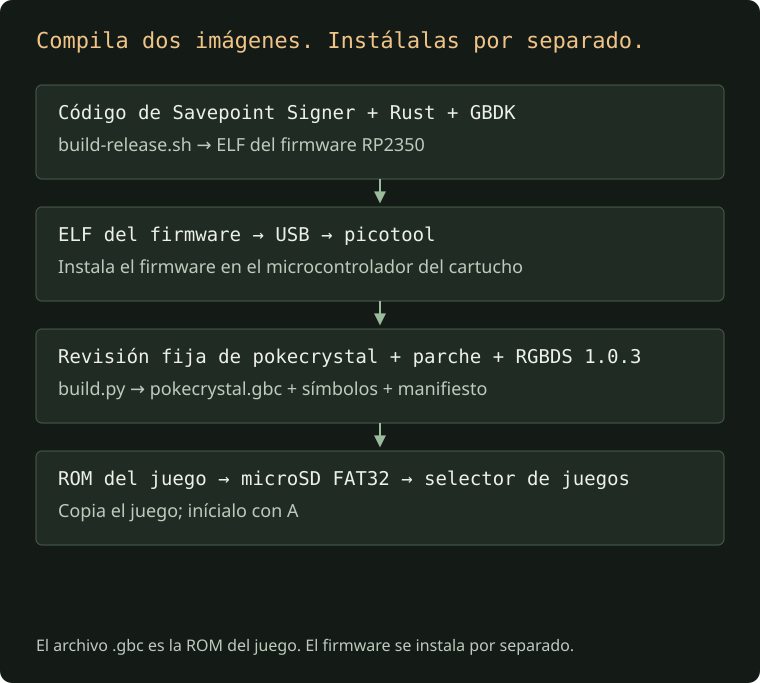
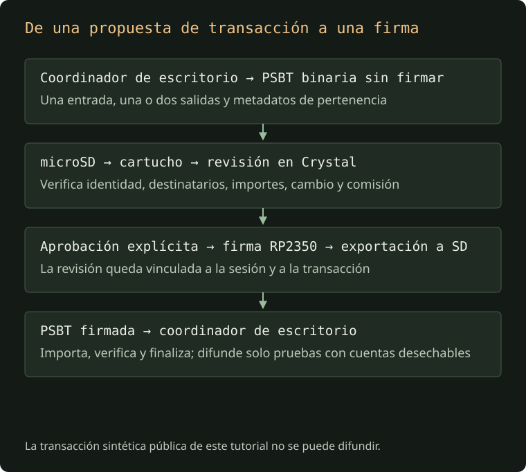

+++
title = "Savepoint Signer: una misión secundaria de Bitcoin para Game Boy"
date = "2026-10-05"
draft = false
categories = ["Desarrollo", "Bitcoin"]
tags = ["bitcoin", "gameboy", "rp2350", "hardware", "open-source", "seedsigner"]
description = "Un firmante de Bitcoin sin conexión, en hardware sin Wi-Fi ni Bluetooth, oculto en Pokémon Crystal: filosofía cypherpunk, arquitectura y tutorial completo de compilación e instalación."
+++

Hay un firmante de Bitcoin escondido en Pueblo Primavera.

Estás jugando a Pokémon Crystal. Te detienes ante un cartel corriente del pueblo, lo lees y vuelves a interactuar con él. Se abre un menú oculto: recuperar una semilla de prueba, verificar tu cuenta, revisar una transacción y aprobar su firma. Bloqueas la sesión y vuelves a la aventura.

[Savepoint Signer](https://github.com/alvroble/savepoint-signer) convierte una consola portátil familiar en un firmante experimental de Bitcoin sin conexión. Sin Wi-Fi, sin Bluetooth y sin cuenta en la nube. Solo la pantalla y los botones que ya conoces, un cartucho modificado y una tarjeta microSD que transporta archivos de transacciones entre la consola y tu ordenador. Su interfaz de firma vive dentro del mundo del juego, esperando a que la descubras.

Este artículo explica la idea, sus límites y el proceso completo de compilación e instalación. Abarca **dos imágenes de software diferentes**: el firmware del cartucho y la ROM del juego con el parche aplicado. También muestra cómo generar por tu cuenta las capturas y un breve vídeo del recorrido.

> **Un experimento, no un monedero para tus ahorros.** Utiliza únicamente semillas de prueba desechables y transacciones sintéticas o monedas de testnet. Este prototipo no tiene una auditoría de seguridad independiente, arranque seguro configurado ni una pantalla de confianza resistente a manipulaciones. Nunca introduzcas una semilla que controle bitcoin de valor. La compatibilidad con mainnet sirve para hacer pruebas; no constituye una garantía de seguridad.


*La base de hardware: una PCB Croco Cartridge. El prototipo documentado utiliza la placa sin carcasa; está prevista una carcasa ajustada al cartucho. Fotografía incluida en el proyecto.*

## La filosofía: sin conexión, discreto y autónomo

Aquí confluyen tres decisiones: hardware sin Wi-Fi ni Bluetooth, una interfaz integrada en el mundo del juego y la preferencia cypherpunk por herramientas que las personas puedan construir y examinar por sí mismas.

### Sin conexión por elección de hardware

Las consolas compatibles —Game Boy Color, Game Boy Advance y GBA SP— no tienen Wi-Fi ni Bluetooth integrados. El diseño Croco V2.1 añade un RP2350, memoria, reloj, USB y microSD, sin incorporar una radio inalámbrica. La [lista de materiales publicada de la placa](https://raw.githubusercontent.com/shilga/rp-gameboy-cartridge-hw/master/KiCad/V2/GameboyCartridgeV2.1/bom.csv) permite examinar esa decisión de hardware.

No hay una pila de comunicaciones inalámbricas que desactivar antes de firmar, un proceso de emparejamiento Bluetooth ni credenciales Wi-Fi que configurar. El flujo de firma intercambia archivos de transacciones mediante una tarjeta que desplazas físicamente. El coordinador conectado a la red prepara la propuesta; la consola la revisa localmente; el cartucho devuelve una firma. El acceso a la red corresponde al coordinador, no al firmante.

USB sigue estando disponible para instalar el firmware. Durante la firma, deja el cartucho desconectado del ordenador. Eliminar las radios reduce la superficie de comunicación, pero no hace automáticamente fiables los archivos entrantes de la SD, el firmware o el juego. «Sin conexión» describe el modelo de funcionamiento; no es una prueba completa de seguridad.

### Discreción a través del mundo del juego

Crystal ya te enseña a explorar, leer carteles y buscar cosas que no resultan evidentes a primera vista. La entrada en Pueblo Primavera —New Bark Town en la ROM inglesa— sigue ese lenguaje. La primera interacción muestra un cartel normal. La segunda revela otra capa del mismo cartucho.

El firmante es un secreto dentro de un mundo jugable. Su menú utiliza la presentación nativa del juego, y bloquear la sesión te devuelve a la aventura. El selector habitual, el juego y el guardado dan al objeto su identidad cotidiana de cartucho. Esa es la discreción buscada: una función útil expresada mediante los hábitos y el entorno del juego, sin transformar toda la consola en una interfaz de monedero llamativa.

Un menú oculto no esconde la implementación a quien examine la ROM o la PCB, ni cifra la semilla. Su función es narrativa y de discreción. La seguridad de la semilla sigue dependiendo del código y del hardware que la manejan.

### Una herramienta cypherpunk que puedes entender

La idea cypherpunk que guía el proyecto es la autonomía práctica: derivar claves y firmar localmente, mantener el material privado lejos de un coordinador conectado, intercambiar propuestas de transacción explícitas y hacer que la aprobación sea un acto físico. La experiencia no necesita una cuenta en línea, un servicio de firma en la nube ni una aplicación inalámbrica complementaria.

El código abierto permite examinar esas decisiones. Puedes compilar el firmware del cartucho, aplicar el parche al juego, seguir una solicitud desde la pulsación de un botón hasta la máquina de estados del firmante y reproducir las pantallas de prueba. Reutilizar una consola antigua da una nueva función a un hardware conocido; el cartucho aporta los recursos de cálculo criptográfico que le faltan a la consola original.

El control personal también exige entender en qué confías. Tanto la ROM como el firmware del cartucho manejan información sensible; modificar cualquiera de los dos puede comprometer la sesión de firma.

## ¿Qué se ejecuta en cada componente?



[Ver el diagrama de arquitectura a tamaño completo](images/architecture.es.svg).

El sistema tiene cuatro partes diferenciadas:

| Componente | Responsabilidad |
| --- | --- |
| Game Boy Color, Game Boy Advance o GBA SP | Ejecuta el juego y proporciona los controles físicos y la pantalla. |
| ROM de Crystal con el parche aplicado | Dibuja los menús del firmante, el teclado, los QR y las pantallas de revisión; envía órdenes al cartucho. |
| Firmware RP2350 de Croco Cartridge V2.1 | Mantiene el funcionamiento del cartucho flash, deriva claves, valida y firma PSBT y accede a la tarjeta SD. |
| Coordinador de escritorio | Crea transacciones sin firmar e importa la PSBT firmada para verificarla, finalizarla y, si procede, difundirla en una red de pruebas. |

La Game Boy no realiza la criptografía de Bitcoin. El RP2350 no sustituye el juego por una pantalla de monedero permanente. El firmware sigue arrancando en el selector de juegos habitual.

Una **PSBT**, o transacción de Bitcoin parcialmente firmada, transporta una propuesta de transacción junto con los metadatos que necesita el firmante. Devolver una PSBT firmada no equivale a difundir una transacción. Savepoint Signer añade una firma; el coordinador completa el trabajo restante.

## Alcance del firmante actual

La interfaz permite recuperar una semilla existente. No es un procedimiento de generación de semillas ni un monedero de Bitcoin de propósito general.

| Función | Límite actual |
| --- | --- |
| Frase mnemónica | 12 o 24 palabras BIP39 en inglés. |
| Frase de contraseña (passphrase) | ASCII imprimible, hasta 100 bytes; los espacios son significativos. |
| Selección de red visible | Mainnet o testnet. Utiliza testnet en este tutorial. |
| Cuenta | SegWit nativo BIP84, cuenta cero. |
| Exportación pública | QR xpub/tpub o zpub/vpub y direcciones de recepción. |
| Formato de transacción | PSBT binaria de versión 0, de hasta 4096 bytes. |
| Entradas | Exactamente una entrada P2WPKH con metadatos de pertenencia y de UTXO. |
| Salidas | Una o dos salidas P2WPKH. |
| Derivación | Rutas BIP84 de la cuenta cero, ramas de recepción y cambio, índice de dirección hasta 1000. |
| Política de firma | SIGHASH_ALL; se rechazan entradas ya firmadas o finalizadas. |
| Protección de comisión | Se rechazan comisiones negativas o superiores a 1 000 000 sat. Este máximo no es una recomendación. |
| Selector de archivos | Solo el directorio raíz; `.psbt` o `.psb`, con una enumeración limitada a un máximo de 32 archivos coincidentes. |
| Archivo firmado | Primer nombre libre: `SIGNED.PSB`, seguido de `SIGNED1.PSB` hasta `SIGNED9.PSB`; no se sobrescriben archivos existentes. |

Taproot, multifirma, entradas de tipos anteriores a SegWit, rutas de cuenta arbitrarias, transacciones con varias entradas y PSBT grandes quedan fuera de la política de esta versión. Un coordinador de escritorio puede crear fácilmente una transacción que exceda estos límites si no lo restringes deliberadamente.

La implementación comprueba los orígenes de las claves frente a la semilla recuperada, deriva la clave pública correspondiente, verifica el script de entrada y reconoce el cambio mediante los metadatos de derivación de la salida. La aprobación queda vinculada a la transacción conservada en memoria y a la sesión; no significa «firma cualquier archivo que esté después en la SD». Consulta la [implementación de la sesión](https://github.com/alvroble/savepoint-signer/blob/ea44dc5a3b7eae2c6b3b0a76aa9aaa346ada7c42/signer-probe/src/seed.rs) para conocer las comprobaciones exactas.

## Antes de compilar

Necesitas:

- Una consola compatible y la **PCB Croco Cartridge V2.1 RP2350**. Este firmware no sirve para un cartucho comercial ordinario ni para una placa RP2040.
- Una tarjeta microSD preparada en FAT32, un lector de tarjetas y un cable USB de datos para el cartucho.
- Git, make, un compilador de C, `patch` y Python 3.12 o posterior para compilar la ROM.
- Rust y el destino `thumbv8m.main-none-eabihf`.
- [GBDK](https://github.com/gbdk-2020/gbdk-2020/releases) para el selector de juegos integrado y un compilador de C compatible con ARM para libsecp256k1.
- **RGBDS 1.0.3** para Crystal. El script de compilación de la ROM comprueba esta versión exacta.
- [picotool](https://github.com/raspberrypi/picotool) con compatibilidad con RP2350 para instalar el firmware.

GBDK y RGBDS tienen funciones diferentes. GBDK compila la pequeña ROM del selector incluida en el firmware del cartucho. RGBDS ensambla el juego Crystal modificado. Tener uno instalado no sustituye al otro.

El proyecto también proporciona una [configuración Dev Container](https://github.com/alvroble/savepoint-signer/blob/ea44dc5a3b7eae2c6b3b0a76aa9aaa346ada7c42/.devcontainer/devcontainer.json) que utiliza la imagen de desarrollo del firmware Croco. Es una alternativa a configurar manualmente las herramientas del firmware; no elimina la necesidad de compilar Crystal ni da acceso automático al dispositivo USB desde el contenedor.

### Mantén identificable la revisión del código fuente

Clona el proyecto y anota la revisión:

```sh
git clone https://github.com/alvroble/savepoint-signer.git
cd savepoint-signer
git rev-parse HEAD
```

Este tutorial se comprobó con `ea44dc5a3b7eae2c6b3b0a76aa9aaa346ada7c42`. Para reproducir explícitamente esa versión del código:

```sh
git checkout ea44dc5a3b7eae2c6b3b0a76aa9aaa346ada7c42
```

Esto deja HEAD apuntando directamente a ese commit, sin una rama activa (estado detached HEAD). Crea una rama si quieres modificarlo. Las revisiones posteriores pueden cambiar la interfaz o la política; utiliza su documentación correspondiente en lugar de combinar firmware y parches de versiones distintas.

### Una disposición concreta de herramientas para Apple Silicon

Después de clonar, estos archivos oficiales proporcionan rutas predecibles para las herramientas del firmware y la ROM. Es la disposición utilizada en la comprobación local de compilación; presupone que Rust, LLVM, make y Python ya están instalados.

```sh
mkdir -p target/toolchains
curl --fail --location \
  https://github.com/gbdk-2020/gbdk-2020/releases/download/4.5.0/gbdk-macos-arm64.tar.gz \
  --output target/toolchains/gbdk.tar.gz
tar -xzf target/toolchains/gbdk.tar.gz -C target/toolchains

curl --fail --location \
  https://github.com/gbdev/rgbds/releases/download/v1.0.3/rgbds-macos.zip \
  --output target/toolchains/rgbds.zip
unzip target/toolchains/rgbds.zip -d target/toolchains/rgbds-1.0.3

target/toolchains/rgbds-1.0.3/rgbasm --version
test -x target/toolchains/gbdk/bin/lcc
```

Utiliza `$PWD/target/toolchains/gbdk` donde el tutorial pida `GBDK_PATH`, y `$PWD/target/toolchains/rgbds-1.0.3` como directorio de RGBDS. macOS Intel y Linux necesitan sus paquetes oficiales correspondientes, en lugar del archivo GBDK ARM64 anterior. Estas descargas instalan las herramientas dentro de este repositorio, no en directorios del sistema.

## Compila las dos imágenes



[Ver el diagrama de compilación a tamaño completo](images/build-path.es.svg).

### 1. Compila el firmware del RP2350

Añade el destino:

```sh
rustup target add thumbv8m.main-none-eabihf
```

Configura `GBDK_PATH` con el directorio de GBDK extraído, que contiene `bin/lcc`, y compila mediante el script del proyecto:

```sh
GBDK_PATH=/absolute/path/to/gbdk sh scripts/build-release.sh
```

Utiliza ese script en lugar de improvisar opciones del enlazador. Sustituye las opciones combinadas de Cargo por un único conjunto explícito, lo que evita duplicar los scripts del enlazador en repositorios anidados. Compila con las dependencias fijadas y después ejecuta las pruebas en el ordenador anfitrión.

En macOS con Apple Silicon, la configuración de LLVM documentada es:

```sh
env 'CC_thumbv8m.main_none_eabihf=/opt/homebrew/opt/llvm/bin/clang' \
    'AR_thumbv8m.main_none_eabihf=/opt/homebrew/opt/llvm/bin/llvm-ar' \
    GBDK_PATH=/absolute/path/to/gbdk \
    sh scripts/build-release.sh
```

Estas rutas presuponen que LLVM está instalado bajo ese prefijo de Homebrew. Adáptalas a tu equipo. En otros sistemas, proporciona herramientas de compilación de C compatibles con ARM y adecuadas para el destino.

El resultado es un **ELF**, aunque no tenga extensión `.elf`:

```text
target/thumbv8m.main-none-eabihf/release/rp2350-gameboy-cartridge
```

La opción de compilación predeterminada `crystal-seed` incluye el firmante. Compilar con `--no-default-features` produce un cartucho flash convencional; es útil para desarrollo, pero no ofrece el backend de firma de este tutorial.

**Punto de comprobación:** el script informa de la ruta del ELF y de su SHA-256, y termina las pruebas del anfitrión correctamente. Que un ELF compile no demuestra que se haya probado un cartucho físico.

### 2. Obtén RGBDS 1.0.3

Utiliza la [versión oficial 1.0.3](https://github.com/gbdev/rgbds/releases/tag/v1.0.3) para tu plataforma. Coloca sus ejecutables en un directorio conocido y comprueba:

```sh
/absolute/path/to/rgbds-1.0.3/rgbasm --version
```

La salida esperada es `rgbasm v1.0.3`.

Para compilar desde el código fuente en Linux, la integración continua del proyecto sigue este esquema:

```sh
sudo apt-get update
sudo apt-get install -y build-essential bison flex libpng-dev pkg-config
mkdir -p target
git clone --depth 1 --branch v1.0.3 \
  https://github.com/gbdev/rgbds target/rgbds
make -C target/rgbds -j2
```

En macOS, la versión precompilada resulta práctica. El Bison del sistema puede ser demasiado antiguo para compilar RGBDS; instalar el binario adecuado evita ese problema.

### 3. Compila la ROM modificada de Crystal

Clona el proyecto de desensamblado original con su historial disponible:

```sh
git clone https://github.com/pret/pokecrystal target/pokecrystal-upstream
```

Después ejecuta el script de compilación de la integración con la ruta de tus ejecutables de RGBDS:

```sh
python3 integrations/pokecrystal/build.py \
  target/pokecrystal-upstream \
  /absolute/path/to/rgbds-1.0.3
```

Si has utilizado la disposición de Linux anterior, el último argumento es la ruta absoluta a `target/rgbds`. Debe ser un directorio que contenga `rgbasm`, `rgblink` y `rgbfix`, no la ruta a un único ejecutable.

El script extrae la revisión exacta del proyecto original fijada en `integrations/pokecrystal/upstream.json`: `7a7881d0d62e0ddbd82dcf10e7116807487ac651`. Aplica el parche de Crystal, añade el código ensamblador nativo del firmante y ejecuta la compilación original en un árbol temporal. No modifica directamente la copia del repositorio original que le proporcionas.

Los archivos resultantes son:

```text
target/crystal/
├── pokecrystal.gbc     # ROM del juego: cópiala a la SD
├── pokecrystal.sym     # símbolos: para pruebas y herramientas de captura
├── pokecrystal.map     # mapa del enlazador
└── manifest.json      # versiones del código y herramientas, hashes SHA-256
```

Conserva los símbolos junto con la ROM si quieres reproducir las pruebas de regresión o el vídeo. `manifest.json` registra la revisión original, la versión de las herramientas y los hashes de los archivos generados y del parche; permite comprobar qué compilación estás probando.

**Punto de comprobación:** el script termina y existen esos cuatro archivos. El proyecto no distribuye la ROM completa del juego en su repositorio ni en sus paquetes de versiones. Compílala localmente a partir del código original y del parche del proyecto; esta guía no ofrece una descarga de la ROM del juego.

## Instala el firmware del cartucho y prepara la tarjeta SD

### 4. Instala el firmware por USB

Apaga la consola, retira el cartucho y conéctalo al ordenador mediante un cable USB de datos. Si ya se está ejecutando un firmware Croco compatible, la orden siguiente solicita automáticamente un reinicio en el cargador de arranque USB, como se describe en las [instrucciones de instalación del proyecto original](https://github.com/shilga/rp2350-gameboy-cartridge-firmware#how-to-flash-the-firmware). Si la placa no tiene firmware o no responde, utiliza primero los pasos de entrada manual en el modo de arranque indicados a continuación.

Desde la raíz del proyecto:

```sh
picotool load -f -u -v -x -t elf \
  target/thumbv8m.main-none-eabihf/release/rp2350-gameboy-cartridge
```

En la [interfaz documentada de picotool](https://github.com/raspberrypi/picotool), `-f` intenta acceder a un dispositivo compatible en funcionamiento, `-u` omite sectores de flash sin cambios, `-v` verifica la escritura, `-x` ejecuta la imagen y `-t elf` especifica el tipo de archivo. Asegúrate de que el destino es tu cartucho, especialmente si hay otros dispositivos de la familia RP conectados.

**Modo de arranque USB manual en V2.1:** el [diseño publicado de la PCB](https://github.com/shilga/rp-gameboy-cartridge-hw/blob/master/KiCad/V2/GameboyCartridgeV2.1/GameboyCartridgeV2.1.kicad_pcb) identifica **JP1**, denominado `USB_BOOT_SEL`, como dos puntos de contacto que conectan `QSPI_SS` a masa. Son los puntos de soldadura previstos para un puente; no se trata del botón de guardado del cartucho. La [guía de hardware del RP2350 de Raspberry Pi, sección 3.1](https://pip-assets.raspberrypi.com/categories/1214-rp2350/documents/RP-008280-DS-1-hardware-design-with-rp2350.pdf?disposition=inline) explica que mantener esa señal a nivel bajo durante el arranque selecciona el cargador de arranque USB. A partir de esas referencias, el procedimiento es:

1. Mantén el cartucho fuera de la consola y desconecta USB. Confirma que la placa es V2.1 y localiza JP1 mediante el diseño.
2. Une temporalmente **solo los dos puntos de contacto de JP1** con una herramienta conductora adecuada y conecta USB mientras mantienes el contacto.
3. Cuando el cargador de arranque USB sea detectado, retira el puente. El ordenador debería mostrar una unidad USB `RP2350`. Deja JP1 abierto antes de instalar el firmware o reiniciar.
4. Ejecuta la orden de carga del firmware anterior. Espera a que picotool termine la verificación y la ejecución antes de desconectar USB.

Estos pasos de entrada manual se deducen del diseño publicado y de la documentación del chip; no se han probado en un cartucho físico para este artículo. Si tu placa es diferente o no puedes identificar JP1, confirma el método de recuperación con su proveedor antes de unir puntos de contacto.

Si picotool no lo encuentra, comprueba el cable, el modo de arranque, los permisos o controladores USB y la versión de picotool. No cambies el código de firma para resolver un fallo de conexión USB.

Esta instalación sustituye el firmware del cartucho. No instala Crystal en la SD. No se instaló firmware en ningún cartucho físico durante la comprobación de este artículo.

### 5. Copia el juego a una microSD FAT32

Haz una copia de seguridad del contenido de la tarjeta antes de formatearla. Una vez que esté en FAT32, copia `target/crystal/pokecrystal.gbc` a su **directorio raíz**. Por ejemplo, tras sustituir el punto de montaje por el real:

```sh
cp target/crystal/pokecrystal.gbc /Volumes/YOUR_SD_CARD/pokecrystal.gbc
```

Expulsa la tarjeta de forma segura. No ejecutes órdenes de formateo sobre un disco sin identificar.

El directorio raíz acabará teniendo este aspecto:

```text
raíz de microSD/
├── pokecrystal.gbc
├── TEST.PSB           # transacción sintética pública opcional del tutorial
└── SIGNED.PSB         # se genera al firmar; no se copia antes
```

Mantén estable el nombre del archivo del juego al sustituir la ROM si quieres que siga utilizando la misma partida guardada. Haz una copia de seguridad de las partidas antes de actualizar. Inserta la tarjeta y el cartucho, enciende la consola, elige Crystal en el selector habitual y pulsa **A**.

### 6. Abre el firmante oculto

Llega a Pueblo Primavera (New Bark Town). Interactúa con el cartel existente del pueblo en la casilla del mapa `(8,8)`, cierra su diálogo original y vuelve a interactuar con él. La segunda interacción abre el menú del firmante. No hace falta añadir un objeto gráfico (sprite) al mapa ni una casilla personalizada.

<div class="savepoint-gallery">
<figure><figcaption>1. El cartel corriente del pueblo.</figcaption></figure>
<figure><figcaption>2. El menú oculto del firmante.</figcaption></figure>
<figure><figcaption>3. Introduce una frase mnemónica de prueba desechable.</figcaption></figure>
</div>

<video controls preload="none" poster="images/new-bark-sign.png" class="savepoint-video" aria-label="Recorrido en emulador desde Pueblo Primavera hasta el menú oculto del firmante">
  <source src="images/new-bark-to-signer.mp4" type="video/mp4">
  <a href="images/new-bark-to-signer.mp4">Ver el recorrido por Pueblo Primavera</a>.
</video>

*El vídeo anterior se volvió a generar para este artículo con el script de captura del emulador del proyecto. Utiliza un estado inicial de prueba; no es una grabación de una consola física.*

*Todas las capturas del juego de este artículo son imágenes reales de 160 × 144 tomadas en el emulador e incluidas en el proyecto. Utilizan un vector público BIP39 y una transacción sintética. Algunas muestran el modo mainnet para comprobar la compatibilidad; los pasos prácticos siguientes seleccionan testnet. El puente de pruebas emula los listados de la SD y las respuestas del cartucho, por lo que estas capturas no demuestran el funcionamiento físico de la SD ni del bus.*

## Recupera, verifica y exporta una cuenta de prueba

Selecciona **Recover seed** (recuperar semilla), después **testnet** y **12 words** (12 palabras) para el ejemplo reproducible siguiente.

La frase mnemónica pública de prueba es once repeticiones de `abandon`, seguidas de `about`:

```text
abandon abandon abandon abandon abandon abandon
abandon abandon abandon abandon abandon about
```

Deja vacía la frase de contraseña para este ejemplo. Esta semilla es pública: cualquiera puede derivar sus claves. Nunca le envíes bitcoin de valor, aunque una pantalla la acepte.

| Pantalla | Controles |
| --- | --- |
| Teclado de palabras | La cruceta mueve el cursor; A escribe; B borra. |
| Lista de candidatas | SELECT cambia el foco; A selecciona una palabra candidata. |
| Frase de contraseña | SELECT cambia la página del teclado; START envía la solicitud de recuperación. |
| Verificación de claves | Compara con el coordinador; A confirma, B bloquea la sesión. |
| QR de la cuenta | B vuelve al menú del firmante. |
| Menú principal del firmante | Elige **Lock and return** (bloquear y volver), o pulsa B, para terminar la sesión. |

Espera a que termine la derivación. Compara la huella de la clave maestra y la dirección de recepción con una cuenta derivada de forma independiente antes de confirmar. Para la frase pública anterior, una frase de contraseña vacía y la ruta testnet `m/84'/1'/0'/0/0`, el vector independiente del proyecto espera:

```text
tb1q6rz28mcfaxtmd6v789l9rrlrusdprr9pqcpvkl
```

La ruta de la cuenta es `m/84'/1'/0'` en testnet y `m/84'/0'/0'` en mainnet. Cambiar la red o la frase de contraseña cambia el resultado esperado. Una frase de contraseña BIP39 forma parte de la derivación; no es una contraseña que se comprueba contra una cuenta almacenada: una frase diferente produce un monedero diferente.

<div class="savepoint-gallery">
<figure><figcaption>La derivación se realiza en el cartucho.</figcaption></figure>
<figure><figcaption>Compara la identidad antes de confirmar. Esta captura utiliza el modo mainnet.</figcaption></figure>
<figure><figcaption>Exportación de la cuenta pública por QR; B vuelve.</figcaption></figure>
</div>

El menú ofrece las codificaciones xpub/tpub y zpub/vpub. Exportan información pública de la cuenta, no la clave privada ni la frase mnemónica. Los datos públicos de la cuenta también revelan la actividad del monedero; trátalos como información sensible para la privacidad.

Para un coordinador como Sparrow, conserva el origen completo de la clave: huella de la clave maestra, ruta de derivación de la cuenta y tipo de script SegWit nativo. Una xpub de cuenta por sí sola no contiene toda esa información. La PSBT necesita la huella correcta y la ruta completa de derivación de la entrada; que una dirección coincida no justifica que falten metadatos.

## Crea una transacción de prueba y fírmala



[Ver el diagrama de firma a tamaño completo](images/signing-flow.es.svg).

### 7. Genera la PSBT sintética pública

Puedes probar el flujo de firma sin adquirir monedas. El proyecto incluye un generador que construye una PSBT binaria a partir de la semilla pública de prueba:

```sh
HOST=$(rustc -vV | sed -n 's/^host: //p')
cargo run -p signer-probe --example make_unsigned \
  --release --locked --target "$HOST" -- target/TEST.PSB
```

Es importante indicar explícitamente el destino anfitrión: este repositorio usa por defecto el destino RP2350, pero el generador debe ejecutarse en tu ordenador. Crea primero `target/` si no existe.

Copia `target/TEST.PSB` a la raíz de la tarjeta FAT32, expúlsala de forma segura y vuelve a introducirla en el cartucho. Recupera la frase mnemónica pública en testnet con una frase de contraseña vacía, verifícala y elige **Sign PSBT** (firmar PSBT).

El ejemplo generado tiene una entrada sintética de 100 000 sat, salidas de 40 000 y 50 000 sat y una comisión de 10 000 sat. Estos valores sirven para comprobar la política y la revisión; no son ajustes de comisión recomendados. La referencia a la salida previa (outpoint) es ficticia, así que la transacción **no puede difundirse como transacción válida**.

**Resultado esperado en la consola:** tanto la salida de 40 000 sat como la de 50 000 sat aparecen como salidas normales, sin que ninguna se etiquete como cambio. El generador no aporta orígenes de claves para las salidas; el firmante activo requiere un origen coincidente de la rama 1 para reconocer el cambio. La política de diagnóstico separada del generador denomina «cambio» a la salida propia, pero esa no es la clasificación que utiliza el juego.

Un primer ensayo útil consiste en abrir la revisión, examinar las páginas y cancelar. Firmar es una acción separada.

### 8. Revisa todas las páginas y después aprueba

Utiliza **izquierda/derecha** en la cruceta para recorrer la revisión de la transacción. Comprueba la red, la dirección y el importe de cada salida, cualquier clasificación de cambio y la comisión. La aprobación no está disponible como atajo para saltarse la secuencia de revisión.

La galería siguiente procede de los casos de prueba de regresión del emulador. La pantalla de cambio reconocido utiliza otro caso de prueba con metadatos de cambio; no es una pantalla esperada para el `TEST.PSB` anterior.

<div class="savepoint-gallery">
<figure><figcaption>Selecciona un archivo de transacción.</figcaption></figure>
<figure><figcaption>Examina el destinatario y el importe.</figcaption></figure>
<figure><figcaption>Cambio reconocido en un caso de prueba de regresión separado.</figcaption></figure>
<figure><figcaption>Lee la comisión.</figcaption></figure>
<figure><figcaption>A firma y guarda; B cancela.</figcaption></figure>
<figure><figcaption>Bloquea la sesión y vuelve a Crystal.</figcaption></figure>
</div>

En **A SIGN AND SAVE** (A: firmar y guardar), pulsa A solo después de revisar. B cancela. El backend vuelve a calcular el hash de firma a partir de la PSBT conservada, lo comprueba contra la revisión, produce la firma y la verifica antes de exportarla.

Busca `SIGNED.PSB` en la tarjeta. Si ya existe, el firmware utiliza el primer nombre numerado libre hasta `SIGNED9.PSB`. Si los diez nombres están ocupados, la exportación falla en lugar de sobrescribir uno. Archiva los archivos existentes en el ordenador antes de otra prueba.

Importa la PSBT firmada en un coordinador compatible para examinar el resultado. En este ejemplo sintético, detente ahí: no hay una transacción válida que difundir. Para una prueba independiente en testnet con una cuenta de usar y desechar, construye una PSBT con exactamente una entrada propia, una o dos salidas SegWit nativas y los datos de origen y UTXO necesarios; vuelve a verificarla en el coordinador antes de cualquier difusión en testnet.

Termina con **Lock and return**, o con B desde el menú principal del firmante. El ciclo de sesión previsto borra el estado de la semilla y los búferes privados de la interfaz antes de volver. El borrado de memoria intenta eliminar los datos sensibles, pero no garantiza que desaparezcan todas las copias de un secreto que hayan generado el compilador o las bibliotecas.

## Las partidas guardadas siguen importando

Utiliza el menú **SAVE** habitual de Crystal. Esta versión modificada coordina automáticamente la persistencia de la SRAM; no requiere el procedimiento separado con el botón físico de guardado descrito en documentación anterior del firmware original.

Cuando cesa la actividad de la SRAM y el juego la desactiva, el firmware espera un periodo de inactividad de 500 ms. Omite los datos sin cambios, escribe un guardado temporal y después guarda el archivo normal. Al arrancar, restaura la partida antes de liberar la señal de reinicio de Game Boy; un archivo temporal completo puede recuperar un guardado principal truncado.

El LED es azul durante la escritura, verde si tiene éxito y rojo si falla. Espera a que termine antes de apagar. El periodo de inactividad y la recuperación mediante archivo temporal reducen el riesgo, pero un corte repentino de alimentación todavía puede hacer que se pierda el último guardado.

La opción **SELECT → RTC config** del selector configura el reloj respaldado por batería. El proyecto recomienda UTC para marcas de tiempo compatibles con el emulador. No es necesario configurar el RTC en juegos sin temporizador.

## Reproduce las capturas y el recorrido

Las capturas son resultados reproducibles de pruebas, no maquetas. El emulador ejecuta la ROM modificada mientras un programa anfitrión ejecuta la máquina de estados de producción del firmante en Rust. Es una comprobación sólida de la interacción entre interfaz y backend, con un puente simulado en lugar del bus físico del cartucho y de la SD.

### 9. Ejecuta las pruebas del anfitrión

El script del firmware ya las ejecuta. Para ejecutar solo esas pruebas:

```sh
HOST=$(rustc -vV | sed -n 's/^host: //p')
cargo test -p cartridge-core -p signer-probe \
  --locked --target "$HOST"
```

En la versión documentada son 104 pruebas: 54 de cartucho, transporte y guardado; 31 pruebas unitarias del backend; tres de firma tras revisión; 14 de SD; y dos de vectores de semilla independientes.

### 10. Ejecuta la regresión de Crystal y genera capturas

Después de compilar la ROM, instala los requisitos de prueba en un entorno local y compila el programa de referencia (oráculo) del anfitrión:

```sh
python3 -m venv target/python
target/python/bin/pip install \
  -r integrations/pokecrystal/requirements-test.txt

HOST=$(rustc -vV | sed -n 's/^host: //p')
cargo build -p signer-probe --example crystal_ui_oracle \
  --release --locked --target "$HOST"

target/python/bin/python integrations/pokecrystal/test_seed.py \
  target/crystal target/crystal-test \
  --oracle "target/$HOST/release/examples/crystal_ui_oracle"
```

Los requisitos fijados son PyBoy 2.7.0 y Pillow 12.3.0. Las capturas PNG aparecen en `target/crystal-test/`.

La regresión comprueba el movimiento por el menú, la entrada de recuperación y la edición de la frase de contraseña, la derivación con retraso, la identidad, cada celda del código QR, el retorno desde el QR, la navegación de archivos, la revisión de transacciones, la limpieza al bloquear, que la SRAM del juego no cambie, los ciclos repetidos de entrada y salida, los atributos del desplazamiento y el flujo real SAVE/CONTINUE en una instancia nueva del emulador.

No demuestra la planificación de ejecución del RP2350, las escrituras físicas en SD, la fiabilidad de la ruta de visualización real ni la resistencia a cortes de alimentación en un cartucho físico. Eso requiere pruebas de hardware.

### 11. Genera el breve vídeo del recorrido por Pueblo Primavera

Instala FFmpeg, conserva la ROM y el oráculo de los pasos anteriores y ejecuta:

```sh
target/python/bin/python integrations/pokecrystal/capture_demo.py \
  target/crystal \
  "target/$HOST/release/examples/crystal_ui_oracle" \
  target/demo/new-bark-to-signer.mp4
```

El vídeo recorre el camino desde un estado inicial de prueba del emulador hasta el cartel y abre el menú. Ese estado omite la configuración inicial del jugador para la grabación; no es una función del parche distribuido. El script no introduce ninguna semilla ni realiza una firma.

## Dentro del enlace con el cartucho

La integración de Crystal escribe órdenes en `$7000–$7002`: orden, identificador de solicitud distinto de cero y página solicitada. Una ventana de respuesta identificada en ROM0 publica páginas de datos de 32 bytes dentro de una trama de 38 bytes. La interfaz valida la secuencia de publicación y la confirmación antes de consumir una instantánea. El informe ocupa 128 bytes; a continuación se sitúan los datos públicos del QR.

Esta interfaz evita deliberadamente utilizar la SRAM del juego respaldada por batería como buzón del firmante. La memoria de guardado de Crystal sigue dedicada al juego. La interfaz utiliza el banco WRAM 2 reservado para sus búferes de trabajo y restaura la selección de banco del motor del juego al volver.

En el RP2350, el núcleo 0 acepta solicitudes acotadas y publica respuestas; el núcleo 1 controla la máquina de estados del firmante y las operaciones de SD. Los identificadores impiden ejecutar dos veces una misma solicitud. Bloquear invalida las respuestas tardías, y la interfaz espera la confirmación de limpieza antes de volver al juego.

Hay una restricción de hardware que debe conservarse: el bucle del controlador de bancos MBC3 y su ruta directa de selección de banco se ejecutan desde RAM, no desde la flash XIP compartida. Las notas de arquitectura describen fallos de recuperación anteriores a ese cambio y recuperaciones correctas en hardware físico después. Las pruebas del emulador no pueden demostrar esa propiedad temporal.

## Resolución de problemas sin conjeturas

| Síntoma | Qué comprobar |
| --- | --- |
| `GBDK lcc not found` | `GBDK_PATH` debe apuntar al directorio que contiene `bin/lcc`. |
| Falla la compilación de C para ARM | Comprueba el compilador y la herramienta de archivado del destino; en la configuración documentada de macOS, utiliza las variables de entorno de LLVM anteriores. |
| `FLASH region already defined` | Utiliza `scripts/build-release.sh` para que la configuración anidada de Cargo no duplique scripts del enlazador. |
| El script de la ROM rechaza RGBDS | Comprueba `rgbasm --version`; debe ser 1.0.3. |
| No se puede extraer el commit original fijado | Utiliza un clon que contenga esa revisión; un clon superficial de una versión más reciente puede no incluirla. |
| No se abre el firmante | Utiliza la ROM modificada correspondiente y el firmware con `crystal-seed` predeterminado; cierra el primer diálogo del cartel y vuelve a interactuar. |
| No aparece la PSBT | Coloca un archivo `.psbt` o `.psb` en la raíz FAT32; evita archivos ocultos y respeta los límites del listado. |
| `Invalid binary PSBT` | Exporta el archivo PSBT en formato binario, no su representación en Base64 renombrada con una extensión PSBT. |
| No coincide la huella o la clave de entrada | Comprueba semilla, frase de contraseña, red, origen completo de la clave y ruta de cuenta en el coordinador. |
| Se rechaza la transacción | Comprueba versión, tamaño, número de entradas y salidas, tipos de script, sighash y metadatos de pertenencia frente a la tabla de política. |
| Falla la exportación firmada tras varias pruebas | Comprueba si están ocupados los diez nombres de salida y si la tarjeta permite escribir. |
| El juego parece perder la partida tras actualizar la ROM | Comprueba si cambió el nombre del archivo de la ROM; restaura una copia de seguridad y comprueba que termine la escritura del guardado. |

## ¿Qué se ha verificado y qué queda pendiente?

Una interfaz de juego funcional y unos vectores criptográficos correctos representan un avance significativo. No bastan para considerar un cartucho modificable un dispositivo de firma apto para su uso con fondos reales.

El repositorio informa de recuperaciones correctas en hardware físico después de trasladar la ruta MBC3 a RAM. Sus notas de verificación también indican que el firmware consolidado y la última interfaz aún necesitan una prueba física básica completa: recuperación, bloqueo y retorno; SAVE del juego y CONTINUE tras apagar y encender; e importación, revisión, firma y exportación de una PSBT sintética.

Este tutorial se comprobó utilizando una copia temporal de esa versión exacta del código en macOS con Apple Silicon:

| Comprobación | Resultado |
| --- | --- |
| Compilación del firmware | Correcta con Rust `1.98.0-nightly (cb46fbb8c 2026-06-08)`, GBDK 4.5.0 y la configuración de LLVM documentada. |
| Inspección del firmware | picotool identifica el ELF como una imagen RP2350; el símbolo MBC3 `run` está en la dirección RAM `0x20000004`. Esto comprueba su ubicación, no los tiempos en hardware físico. |
| Suite del anfitrión | Las 104 pruebas pasaron. |
| Compilación de Crystal | Correcta con RGBDS 1.0.3 y la revisión original fijada. |
| SHA-256 de la ROM | `d51bb7af93d7b1a5817fc29ea0a00dd494fcd2c1db9abb4756b9b2b3f0192754` |
| Regresión de la interfaz | Pasaron recuperación, QR, revisión de transacción, limpieza, diez retornos, desplazamiento, SAVE y CONTINUE en una instancia nueva. |
| Generador de PSBT sintética | Correcto; produjo un archivo binario de prueba de 226 bytes. |
| Vídeo del recorrido | Generado correctamente con el script de captura y FFmpeg. |
| Instalación física del firmware, firma con SD física y difusión | No realizadas para este artículo. |

El script de compilación de la ROM se ejecutó con Python 3.14; las comprobaciones del emulador, en un entorno Python 3.11 con los paquetes fijados. El requisito de instalación documentado del proyecto sigue siendo Python 3.12 o posterior para el flujo completo. Ninguna herramienta ni resultado de prueba de este artículo acredita la idoneidad para utilizar fondos reales.

La filosofía se mantiene mientras madura la implementación: firmar en hardware sin Wi-Fi ni Bluetooth, una entrada discreta integrada en el juego y código que se puede compilar y examinar. El siguiente trabajo de ingeniería consiste en hacer esos límites más medibles: comprobaciones de hardware repetibles, comportamiento temporal documentado, revisión de la relación de confianza entre ROM y firmware y evaluación independiente de seguridad. El valor del proyecto hoy es que puedes construirlo, examinar sus decisiones, reproducir su interfaz y entender hasta dónde llega la confianza.

## Código fuente, procedencia y créditos

Este tutorial describe la revisión [`ea44dc5`](https://github.com/alvroble/savepoint-signer/tree/ea44dc5a3b7eae2c6b3b0a76aa9aaa346ada7c42) de Savepoint Signer. Las capturas y la fotografía del cartucho proceden de esa versión del proyecto. Los diagramas de arquitectura, compilación y firma son ilustraciones explicativas; no constituyen pruebas de hardware.

Referencias primarias útiles:

- [Arquitectura y límites de Savepoint Signer](https://github.com/alvroble/savepoint-signer/blob/ea44dc5a3b7eae2c6b3b0a76aa9aaa346ada7c42/docs/architecture.md).
- [Procedimientos y evidencias de verificación](https://github.com/alvroble/savepoint-signer/blob/ea44dc5a3b7eae2c6b3b0a76aa9aaa346ada7c42/docs/testing.md).
- [Integración y compilación de Crystal](https://github.com/alvroble/savepoint-signer/tree/ea44dc5a3b7eae2c6b3b0a76aa9aaa346ada7c42/integrations/pokecrystal).
- [Galería original de capturas](https://github.com/alvroble/savepoint-signer/tree/ea44dc5a3b7eae2c6b3b0a76aa9aaa346ada7c42/docs/screenshots).
- [Hardware Croco Cartridge V2.1](https://github.com/shilga/rp-gameboy-cartridge-hw/tree/master/KiCad/V2/GameboyCartridgeV2.1) y [firmware original de Sebastian Quilitz](https://github.com/shilga/rp2350-gameboy-cartridge-firmware).
- [pret/pokecrystal](https://github.com/pret/pokecrystal), el desensamblado en el que se basa la modificación del juego.

El firmware tiene licencia GPL-3.0-or-later; los componentes de terceros conservan sus licencias. Es un experimento independiente de aficionados, sin afiliación con Nintendo, Game Freak, Creatures ni The Pokémon Company. Los paquetes de versiones incluyen código fuente, firmware y el parche y el script de compilación vinculados a una revisión concreta del código, en lugar de una ROM completa del juego.

<style>
.reading-content .content blockquote::after { display: none !important; content: none !important; }
.savepoint-video { display: block; width: 100%; max-width: 480px; margin: 24px auto; background: #111; image-rendering: pixelated; }
.savepoint-gallery { display: grid; grid-template-columns: repeat(auto-fit, minmax(160px, 1fr)); gap: 22px; margin: 28px 0; }
.content .savepoint-gallery figure { margin: 0; min-width: 0; }
.content .savepoint-gallery img { display: block; width: 100%; max-width: 240px; height: auto; margin: 0 auto; image-rendering: pixelated; border-radius: 0; border: 1px solid #54624e; }
.savepoint-gallery figcaption { margin-top: 10px; font-family: var(--mono-font-stack); font-size: 12px; line-height: 1.6; color: var(--muted); }
@media(max-width: 480px) { .savepoint-gallery { grid-template-columns: 1fr; } }
</style>
