+++
title = "Savepoint Signer: A Bitcoin Side Quest for the Game Boy"
date = "2026-10-05"
draft = false
categories = ["Development", "Bitcoin"]
tags = ["bitcoin", "gameboy", "rp2350", "hardware", "open-source", "seedsigner"]
description = "An offline Bitcoin signer on hardware without Wi-Fi or Bluetooth, hidden in Pokémon Crystal: the cypherpunk philosophy, architecture, and complete build-and-flash tutorial."
+++

There is a Bitcoin signer hidden in New Bark Town.

You are playing Pokémon Crystal. You stop at an ordinary town sign, read it, and interact again. A hidden menu opens: recover a test seed, verify your account, review a transaction, and approve its signature. Lock the session, and you are back in the adventure.

[Savepoint Signer](https://github.com/alvroble/savepoint-signer) turns a familiar handheld into an experimental offline Bitcoin signer. No Wi-Fi, no Bluetooth, no cloud account. Just the screen and buttons you already know, a modified game cartridge, and a microSD card that carries transaction files between the handheld and your computer. Its signing interface lives inside the game's world, waiting to be discovered.

This article explains the idea, the boundaries, and the complete build-and-install path. It covers **two different images**: the cartridge firmware and the patched game ROM. It also shows how to generate the screenshots and a short walkthrough video yourself.

> **An experiment, not a wallet for savings.** Use disposable test seeds and synthetic transactions or testnet coins only. This prototype has no independent security audit, no configured secure boot, and no tamper-resistant trusted display. Never enter a seed that controls valuable bitcoin. Mainnet compatibility is a testing feature, not a safety claim.

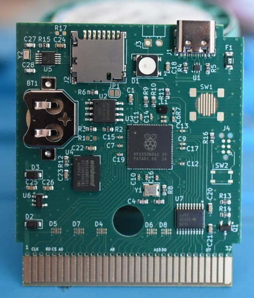

*The hardware foundation: a Croco Cartridge PCB. The documented prototype uses a bare board; a fitted cartridge shell is planned. Photo supplied with the project.*

## The philosophy: offline, inconspicuous, self-directed

Three choices belong together here: hardware without Wi-Fi or Bluetooth, an interface woven into the game's lore, and a cypherpunk preference for tools people can build and inspect themselves.

### Offline by hardware choice

The supported Game Boy Color, Game Boy Advance, and GBA SP have no built-in Wi-Fi or Bluetooth. The Croco V2.1 design adds an RP2350, memory, a clock, USB, and microSD, without adding a wireless radio. The [published board bill of materials](https://raw.githubusercontent.com/shilga/rp-gameboy-cartridge-hw/master/KiCad/V2/GameboyCartridgeV2.1/bom.csv) provides an inspectable basis for that hardware choice.

There is no wireless stack to switch off before signing, no Bluetooth pairing ceremony, and no Wi-Fi credentials to configure. The signing workflow exchanges transaction files through a card you physically move. The network-connected coordinator prepares the proposal; the handheld reviews it locally; the cartridge returns a signature. Network access belongs to the coordinator, not the signer.

USB remains available for firmware installation. During signing, leave the cartridge disconnected from the computer. Removing radios narrows the communication surface, but it does not make incoming SD files, firmware, or the game trustworthy automatically. Offline describes the operating model; it is not a complete security proof.

### Stealth through the game's lore

Crystal already teaches you to explore, read signs, and look for things that are not obvious on the first pass. The New Bark Town entrance follows that language. The first interaction is an ordinary sign. The second reveals another layer of the same cartridge.

The signer is an easter egg within a playable world. Its menu uses the game's native presentation, and locking the session returns you to your adventure. The ordinary selector, gameplay, and save flow give the object its everyday identity as a game cartridge. That is the intended stealth: a useful capability expressed through the habits and setting of the game, without turning the whole handheld into a conspicuous wallet interface.

A hidden menu does not conceal the implementation from someone inspecting the ROM or PCB, and it does not encrypt the seed. Its role is narrative and discretion. The seed's security still depends on the code and hardware that handle it.

### A cypherpunk tool you can understand

The cypherpunk thread is practical autonomy: derive and sign locally, keep private material away from an online coordinator, exchange explicit transaction proposals, and make approval a physical act. The experience needs no online account, cloud signing service, or wireless companion app.

Open source makes those choices available for inspection. You can build the cartridge firmware, apply the game patch, follow a request from a button press into the signer state machine, and reproduce the test screens. Reusing an old handheld puts familiar hardware in a new role; the cartridge supplies the cryptographic computing resources the original console lacks.

Personal control also means understanding what you are trusting. Both the ROM and cartridge firmware handle sensitive information; modifying either can compromise the signing session.

## What actually runs where?

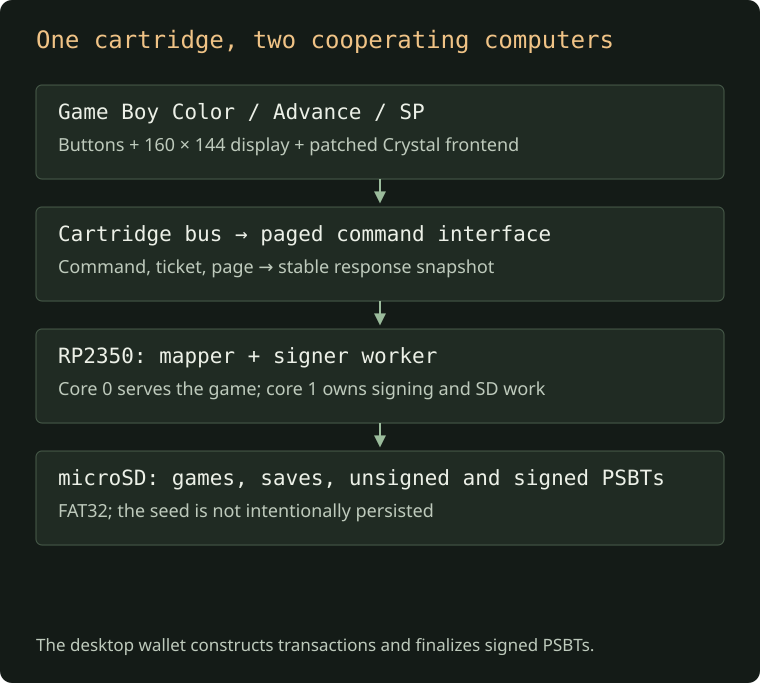

[Open the architecture diagram at full size](images/architecture.svg).

The system has four distinct parts:

| Part | Responsibility |
| --- | --- |
| Game Boy Color, Game Boy Advance, or GBA SP | Runs the game and supplies physical input and the display. |
| Patched Crystal ROM | Draws the signer menus, keyboard, QR, and review screens; sends commands to the cartridge. |
| Croco Cartridge V2.1 RP2350 firmware | Keeps the flashcart working, derives keys, validates and signs PSBTs, and accesses the SD card. |
| Desktop coordinator | Creates unsigned transactions and imports the signed PSBT for verification, finalization, and any test-network broadcast. |

The Game Boy does not perform the Bitcoin cryptography. The RP2350 does not replace the game with a permanently running wallet screen. The firmware still starts at the ordinary game selector.

A **PSBT**, or Partially Signed Bitcoin Transaction, carries a transaction proposal plus the metadata a signer needs. Returning a signed PSBT is different from broadcasting a transaction. Savepoint Signer adds a signature; the coordinator completes the remaining work.

## The scope of the current signer

The interface supports recovery of an existing seed. It is not a seed-generation ceremony or a general-purpose Bitcoin wallet.

| Capability | Current boundary |
| --- | --- |
| Mnemonic | 12 or 24 English BIP39 words. |
| Passphrase | Printable ASCII, up to 100 bytes; spaces are significant. |
| Visible network selection | Mainnet or testnet. Use testnet for this tutorial. |
| Account | Native SegWit BIP84, account zero. |
| Public export | xpub/tpub or zpub/vpub QR, plus receive addresses. |
| Transaction format | Binary PSBT version 0, at most 4,096 bytes. |
| Inputs | Exactly one P2WPKH input with ownership and UTXO metadata. |
| Outputs | One or two P2WPKH outputs. |
| Derivation | Account-zero BIP84 paths, receive/change branches, address index up to 1,000. |
| Signature policy | SIGHASH_ALL; already signed or finalized inputs are rejected. |
| Fee guard | Negative fees and fees above 1,000,000 sat are rejected. This ceiling is not a recommendation. |
| File picker | Root directory only; `.psbt` or `.psb`, with bounded enumeration of up to 32 matching files. |
| Signed output | First free `SIGNED.PSB`, then `SIGNED1.PSB` through `SIGNED9.PSB`; existing files are not overwritten. |

Taproot, multisig, legacy inputs, arbitrary account paths, multiple-input transactions, and large PSBTs are outside this version's policy. A desktop coordinator will often create a transaction that exceeds these limits unless you deliberately constrain it.

The implementation checks key origins against the recovered seed, derives the relevant public key, verifies the input script, and recognizes change through the output's derivation metadata. Approval is bound to the held transaction and session; it does not mean “sign whatever file happens to be on the SD card later.” See the [session implementation](https://github.com/alvroble/savepoint-signer/blob/ea44dc5a3b7eae2c6b3b0a76aa9aaa346ada7c42/signer-probe/src/seed.rs) for the exact checks.

## Before building

You need:

- A compatible handheld and the **Croco Cartridge V2.1 RP2350 PCB**. This firmware is not for an ordinary retail cartridge or an RP2040 board.
- A microSD card prepared as FAT32, a card reader, and a USB data cable for the cartridge.
- Git, make, a C compiler, `patch`, and Python 3.12 or newer for the ROM build.
- Rust and the `thumbv8m.main-none-eabihf` target.
- [GBDK](https://github.com/gbdk-2020/gbdk-2020/releases) for the embedded game selector, and an ARM-capable C compiler for libsecp256k1.
- **RGBDS 1.0.3** for Crystal. The ROM builder checks this exact version.
- [picotool](https://github.com/raspberrypi/picotool) with RP2350 support for flashing.

GBDK and RGBDS serve different jobs. GBDK builds the small selector ROM embedded in the cartridge firmware. RGBDS assembles the patched Crystal game. Having one installed does not replace the other.

The project also supplies a [Dev Container configuration](https://github.com/alvroble/savepoint-signer/blob/ea44dc5a3b7eae2c6b3b0a76aa9aaa346ada7c42/.devcontainer/devcontainer.json) using the Croco firmware development image. That is an alternative to arranging the firmware tools manually; it does not remove the need to build Crystal or give the container automatic access to your USB device.

### Keep the source revision identifiable

Clone the project and record the revision:

```sh
git clone https://github.com/alvroble/savepoint-signer.git
cd savepoint-signer
git rev-parse HEAD
```

This walkthrough was checked against `ea44dc5a3b7eae2c6b3b0a76aa9aaa346ada7c42`. To reproduce that source snapshot explicitly:

```sh
git checkout ea44dc5a3b7eae2c6b3b0a76aa9aaa346ada7c42
```

That leaves the checkout at a detached commit. Create a branch if you want to modify it. Later revisions may change the UI or policy; use their matching documentation rather than combining unrelated firmware and patches.

### A concrete Apple Silicon tool layout

After cloning, these official archives give the firmware and ROM tools predictable paths. This is the tool layout used for the local build check; it assumes Rust, LLVM, make, and Python are already installed.

```sh
mkdir -p target/toolchains
curl --fail --location \
  https://github.com/gbdk-2020/gbdk-2020/releases/download/4.5.0/gbdk-macos-arm64.tar.gz \
  --output target/toolchains/gbdk.tar.gz
tar -xzf target/toolchains/gbdk.tar.gz -C target/toolchains

curl --fail --location \
  https://github.com/gbdev/rgbds/releases/download/v1.0.3/rgbds-macos.zip \
  --output target/toolchains/rgbds.zip
unzip target/toolchains/rgbds.zip -d target/toolchains/rgbds-1.0.3

target/toolchains/rgbds-1.0.3/rgbasm --version
test -x target/toolchains/gbdk/bin/lcc
```

Use `$PWD/target/toolchains/gbdk` wherever the tutorial asks for `GBDK_PATH`, and `$PWD/target/toolchains/rgbds-1.0.3` as the RGBDS directory. Intel macOS and Linux need their matching official packages rather than the ARM64 GBDK archive above. The archive downloads install tools in this checkout, not into system directories.

## Build the two images

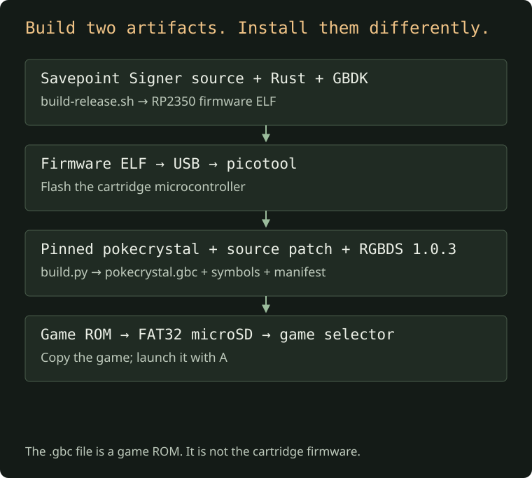

[Open the build diagram at full size](images/build-path.svg).

### 1. Build the RP2350 firmware

Add the target:

```sh
rustup target add thumbv8m.main-none-eabihf
```

Set `GBDK_PATH` to the extracted GBDK directory, the one containing `bin/lcc`, and build through the project's wrapper:

```sh
GBDK_PATH=/absolute/path/to/gbdk sh scripts/build-release.sh
```

Use the wrapper instead of improvising linker flags. It replaces merged Cargo flags with one explicit set, which avoids duplicate linker scripts in nested checkouts. It builds with locked dependencies and then runs the host tests.

On Apple Silicon macOS, the documented LLVM configuration is:

```sh
env 'CC_thumbv8m.main_none_eabihf=/opt/homebrew/opt/llvm/bin/clang' \
    'AR_thumbv8m.main_none_eabihf=/opt/homebrew/opt/llvm/bin/llvm-ar' \
    GBDK_PATH=/absolute/path/to/gbdk \
    sh scripts/build-release.sh
```

Those compiler paths assume LLVM is installed under that Homebrew prefix. Adjust them for your machine. On other systems, provide an ARM-capable C toolchain appropriate to the target.

The output is an **ELF**, despite having no `.elf` extension:

```text
target/thumbv8m.main-none-eabihf/release/rp2350-gameboy-cartridge
```

The default `crystal-seed` feature includes the signer. Building with `--no-default-features` produces a plain flashcart; that is useful for development, but it will not provide this tutorial's signer backend.

**Checkpoint:** the wrapper reports the ELF path and its SHA-256 and finishes its host tests successfully. An ELF that builds is not evidence that a physical cartridge has been tested.

### 2. Obtain RGBDS 1.0.3

Use the [official 1.0.3 release](https://github.com/gbdev/rgbds/releases/tag/v1.0.3) for your platform. Put its executables in a known directory and check:

```sh
/absolute/path/to/rgbds-1.0.3/rgbasm --version
```

The expected output is `rgbasm v1.0.3`.

For a Linux source build, the project's CI follows this pattern:

```sh
sudo apt-get update
sudo apt-get install -y build-essential bison flex libpng-dev pkg-config
mkdir -p target
git clone --depth 1 --branch v1.0.3 \
  https://github.com/gbdev/rgbds target/rgbds
make -C target/rgbds -j2
```

On macOS, the prebuilt release is convenient. The system Bison can be too old to compile RGBDS; installing the right RGBDS binary avoids that particular detour.

### 3. Build the modified Crystal ROM

Clone the upstream disassembly with its history available:

```sh
git clone https://github.com/pret/pokecrystal target/pokecrystal-upstream
```

Then run the integration builder with the path to your RGBDS executables:

```sh
python3 integrations/pokecrystal/build.py \
  target/pokecrystal-upstream \
  /absolute/path/to/rgbds-1.0.3
```

If you used the Linux layout above, the last argument is the absolute path to `target/rgbds`. It must be a directory containing `rgbasm`, `rgblink`, and `rgbfix`, not the path to one executable.

The builder archives the exact upstream revision pinned in `integrations/pokecrystal/upstream.json`: `7a7881d0d62e0ddbd82dcf10e7116807487ac651`. It applies the Crystal patch, adds the native signer assembly, and runs the upstream build in a temporary tree. It does not patch your supplied upstream checkout in place.

The outputs are:

```text
target/crystal/
├── pokecrystal.gbc     # game ROM: copy this to the SD card
├── pokecrystal.sym     # symbols: used by tests and capture tools
├── pokecrystal.map     # linker map
└── manifest.json      # source/tool versions and SHA-256 hashes
```

Keep the symbols with the ROM if you want to reproduce the regression or video. `manifest.json` records the upstream revision, tool version, and artifact/patch hashes; it is useful for checking which build you are testing.

**Checkpoint:** the builder completes and those four files exist. The project does not distribute the complete game ROM in its repository or release archives. Build it locally from the upstream source and project patch; this guide does not provide a game-ROM download.

## Flash the cartridge and prepare the SD card

### 4. Flash the firmware over USB

Turn the handheld off, remove the cartridge, and connect it to the computer with a data-capable USB cable. If compatible Croco firmware is already running, the command below requests a reboot into the USB bootloader automatically, as described in the [upstream flashing instructions](https://github.com/shilga/rp2350-gameboy-cartridge-firmware#how-to-flash-the-firmware). For a blank or unresponsive board, use the manual boot-mode steps below first.

From the project root:

```sh
picotool load -f -u -v -x -t elf \
  target/thumbv8m.main-none-eabihf/release/rp2350-gameboy-cartridge
```

In [picotool's documented interface](https://github.com/raspberrypi/picotool), `-f` attempts to reach a compatible running device, `-u` skips unchanged flash sectors, `-v` verifies the write, `-x` executes the image, and `-t elf` specifies the file type. Ensure the target is your cartridge, especially if other RP-series devices are connected.

**Manual USB boot mode on V2.1:** the [published PCB layout](https://github.com/shilga/rp-gameboy-cartridge-hw/blob/master/KiCad/V2/GameboyCartridgeV2.1/GameboyCartridgeV2.1.kicad_pcb) identifies **JP1**, named `USB_BOOT_SEL`, as two pads connecting `QSPI_SS` to ground. This is a jumper footprint, not the cartridge's game-save button. Raspberry Pi's [RP2350 hardware guide, section 3.1](https://pip-assets.raspberrypi.com/categories/1214-rp2350/documents/RP-008280-DS-1-hardware-design-with-rp2350.pdf?disposition=inline) explains that holding this signal low at startup selects the USB bootloader. From those references, the procedure is:

1. Keep the cartridge out of the handheld and disconnect USB. Confirm your board is V2.1 and locate JP1 using the layout.
2. Temporarily bridge **only the two JP1 pads** with a suitable conductive tool, then connect USB while maintaining contact.
3. Once the USB bootloader enumerates, remove the bridge. The computer should show an `RP2350` USB drive. Leave JP1 open before flashing or restarting.
4. Run the firmware-loading command above. Wait for picotool to finish verification and execution before disconnecting USB.

These manual-entry steps are derived from the published design and chip documentation; they have not been exercised on a physical cartridge for this article. If your board differs or you cannot identify JP1, confirm the recovery method with its supplier before bridging pads.

If picotool cannot find it, check the cable, device boot mode, USB permissions or drivers, and the picotool version. Do not change signing code to solve a USB connection failure.

Flashing replaces the firmware on the cartridge. It does not install Crystal on the SD card. No physical cartridge was flashed while checking this article.

### 5. Copy the game to a FAT32 microSD card

Back up any existing card contents before formatting. Once the card is FAT32, copy `target/crystal/pokecrystal.gbc` to its **root directory**. For example, after substituting the real mount point:

```sh
cp target/crystal/pokecrystal.gbc /Volumes/YOUR_SD_CARD/pokecrystal.gbc
```

Safely eject the card. Do not run formatting commands against an unidentified disk.

The expected root will eventually look like this:

```text
microSD root/
├── pokecrystal.gbc
├── TEST.PSB           # optional public synthetic tutorial transaction
└── SIGNED.PSB         # produced after signing, not copied in advance
```

Keep the game's filename stable when replacing its ROM if you want it to keep using the same save file. Back up saves before upgrades. Insert the card and cartridge, power on, choose Crystal in the normal selector, and press **A**.

### 6. Open the hidden signer

Reach New Bark Town. Interact with the existing town sign at map tile `(8,8)`, dismiss its original dialogue, and interact with it again. The second interaction opens the signer menu. No extra overworld sprite or custom map tile is required.

<div class="savepoint-gallery">
<figure>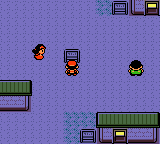<figcaption>1. The ordinary town sign.</figcaption></figure>
<figure>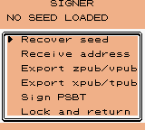<figcaption>2. The hidden signer menu.</figcaption></figure>
<figure>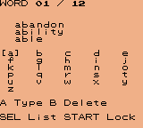<figcaption>3. Enter a disposable test mnemonic.</figcaption></figure>
</div>

<video controls preload="none" poster="images/new-bark-sign.png" class="savepoint-video" aria-label="Emulator walkthrough from New Bark Town to the hidden signer menu">
  <source src="images/new-bark-to-signer.mp4" type="video/mp4">
  <a href="images/new-bark-to-signer.mp4">Watch the New Bark walkthrough</a>.
</video>

*The walkthrough above was regenerated for this article using the project's emulator capture script. It uses a test start fixture, not a physical console recording.*

*All game screenshots in this article are actual 160 × 144 emulator captures supplied with the project. They use a public BIP39 vector and a synthetic transaction. Some show mainnet mode to exercise compatibility; the practical steps below select testnet. The bridge emulates SD listings and cartridge responses, so these captures do not establish physical SD or bus operation.*

## Recover, verify, and export a test account

Select **Recover seed**, then **testnet** and **12 words** for the reproducible fixture below.

The public test mnemonic is eleven occurrences of `abandon`, followed by `about`:

```text
abandon abandon abandon abandon abandon abandon
abandon abandon abandon abandon abandon about
```

Leave its passphrase empty for the fixture. This seed is public: anyone can derive its keys. Never fund it with valuable bitcoin, even if a screen accepts it.

| Screen | Controls |
| --- | --- |
| Word keyboard | D-pad moves; A types; B deletes. |
| Candidate list | SELECT changes focus; A selects a candidate word. |
| Passphrase | SELECT switches keyboard page; START submits recovery. |
| Verify keys | Compare with the coordinator; A confirms, B locks. |
| Account QR | B returns to the signer menu. |
| Main signer menu | Choose **Lock and return**, or press B, to end the session. |

Wait for derivation. Compare the fingerprint and receive address against a separately derived account before confirming. For the public mnemonic above, empty passphrase, and testnet path `m/84'/1'/0'/0/0`, the project's independent vector expects:

```text
tb1q6rz28mcfaxtmd6v789l9rrlrusdprr9pqcpvkl
```

The account path is `m/84'/1'/0'` for testnet and `m/84'/0'/0'` for mainnet. Changing the network or passphrase changes what you should expect. A BIP39 passphrase is part of derivation, not a password checked against a stored account: a different passphrase produces a different wallet.

<div class="savepoint-gallery">
<figure>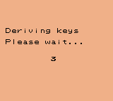<figcaption>Derivation takes place on the cartridge.</figcaption></figure>
<figure>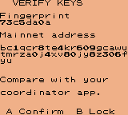<figcaption>Compare identity before confirming. This capture uses mainnet mode.</figcaption></figure>
<figure><figcaption>Public account QR export; B returns.</figcaption></figure>
</div>

The menu offers both xpub/tpub and zpub/vpub encodings. They export public account information, not the private key or mnemonic. Public account data still reveals wallet activity, so treat it as privacy-sensitive.

For a coordinator such as Sparrow, preserve the full key origin: master fingerprint, account derivation path, and Native SegWit script type. A bare account xpub does not contain all that information. The PSBT needs the correct fingerprint and full input derivation path; matching an address alone does not excuse missing metadata.

## Make a transaction fixture and sign it

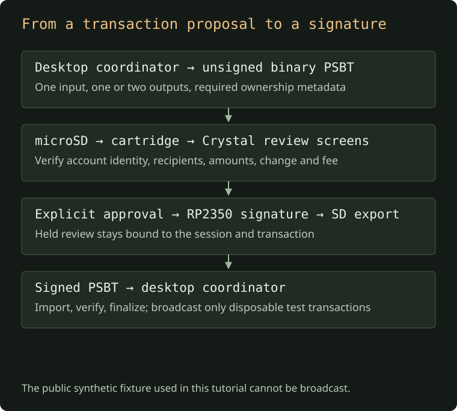

[Open the signing diagram at full size](images/signing-flow.svg).

### 7. Generate the public synthetic PSBT

You can exercise the signing path without acquiring coins. The project includes a fixture generator that builds a binary PSBT from the public test seed:

```sh
HOST=$(rustc -vV | sed -n 's/^host: //p')
cargo run -p signer-probe --example make_unsigned \
  --release --locked --target "$HOST" -- target/TEST.PSB
```

The explicit host target matters: this repository defaults to the RP2350 target, but the generator must run on your computer. Create `target/` first if it does not exist.

Copy `target/TEST.PSB` to the FAT32 card's root, safely eject, and put the card back in the cartridge. Recover the public mnemonic on testnet with an empty passphrase, verify it, and choose **Sign PSBT**.

The generated fixture has a synthetic 100,000-sat input, 40,000-sat and 50,000-sat outputs, and a 10,000-sat fee. Those values exercise policy and review; they are not recommended fee settings. Its outpoint is fabricated, so the transaction **cannot be broadcast**.

**Expected on the handheld:** both the 40,000-sat and 50,000-sat outputs appear as ordinary outputs, with neither labelled as change. The generator supplies no output key origins; the active signer requires a matching branch-1 key origin to recognize change. The generator's separate diagnostic policy calls the self-output “change,” but that is not the classification used by the game.

A useful first rehearsal is to open review, inspect the pages, and cancel. Signing is a separate action.

### 8. Review every page, then approve

Use the D-pad's **left/right** controls to move through the transaction review. Check the network, each output address and amount, any change classification, and the fee. Approval is not available as a shortcut past the review sequence.

The gallery below comes from the emulator regression fixtures. Its recognized-change screen uses a different fixture with change metadata; it is not an expected screen for `TEST.PSB` above.

<div class="savepoint-gallery">
<figure>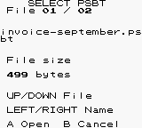<figcaption>Select a transaction file.</figcaption></figure>
<figure>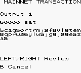<figcaption>Inspect the recipient and amount.</figcaption></figure>
<figure>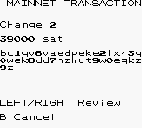<figcaption>Recognized change in a separate regression fixture.</figcaption></figure>
<figure>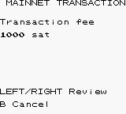<figcaption>Read the fee.</figcaption></figure>
<figure>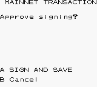<figcaption>A signs and saves; B cancels.</figcaption></figure>
<figure>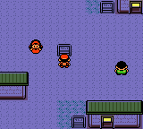<figcaption>Lock the session and return to Crystal.</figcaption></figure>
</div>

At **A SIGN AND SAVE**, press A only after review. B cancels. The backend recomputes the signing hash from the held PSBT, checks it against the review, produces the signature, and verifies it before export.

Look for `SIGNED.PSB` on the card. If it already exists, the firmware uses the first free numbered name through `SIGNED9.PSB`. If all ten slots are occupied, export fails rather than overwriting one. Archive existing outputs on the computer before another test.

Import the signed PSBT into a compatible coordinator to inspect the result. For this synthetic fixture, stop there: there is no valid transaction to broadcast. For a separate disposable testnet experiment, construct a PSBT with exactly one owned input, one or two native-SegWit outputs, and the required origins and UTXO data; verify it on the coordinator again before any testnet broadcast.

Finish with **Lock and return**, or B from the main signer menu. The intended session lifecycle clears seed state and the frontend's private buffers before returning. Memory clearing is best-effort; it is not proof that every compiler or library copy of a secret is gone.

## Game saves still matter

Use Crystal's normal **SAVE** menu. This fork automatically coordinates SRAM persistence; it does not require the separate hardware save-button workflow described in older upstream firmware documentation.

After SRAM activity stops and the game disables SRAM, the firmware waits for a 500 ms quiet period. It skips unchanged data, writes a temporary save, and then persists the normal save. Startup restores the save before releasing Game Boy reset; a complete temporary file can recover a truncated primary save.

The LED is blue during a save write, green on success, and red on failure. Wait for completion before powering off. The quiet period and temporary-file recovery reduce risk, but sudden power loss can still lose the latest save.

The selector's **SELECT → RTC config** sets the battery-backed clock. UTC is the project's recommendation for emulator-compatible timestamps. RTC setup is unnecessary for games without a timer.

## Reproduce the screenshots and walkthrough

The screenshots are reproducible test artifacts, not mockups. The emulator executes the patched ROM while a host program runs the production Rust signer state machine. It is a strong check of the interface/backend interaction, with a simulated bridge in place of the physical cartridge bus and SD card.

### 9. Run the host tests

The firmware wrapper already runs them. To run only those tests:

```sh
HOST=$(rustc -vV | sed -n 's/^host: //p')
cargo test -p cartridge-core -p signer-probe \
  --locked --target "$HOST"
```

At the documented snapshot, that is 104 tests: 54 cartridge/transport/save tests, 31 backend unit tests, three reviewed-signing tests, 14 SD tests, and two independent seed-vector tests.

### 10. Run the Crystal regression and generate screen captures

After building the ROM, install the test requirements in a local environment and compile the host oracle:

```sh
python3 -m venv target/python
target/python/bin/pip install \
  -r integrations/pokecrystal/requirements-test.txt

HOST=$(rustc -vV | sed -n 's/^host: //p')
cargo build -p signer-probe --example crystal_ui_oracle \
  --release --locked --target "$HOST"

target/python/bin/python integrations/pokecrystal/test_seed.py \
  target/crystal target/crystal-test \
  --oracle "target/$HOST/release/examples/crystal_ui_oracle"
```

The pinned requirements are PyBoy 2.7.0 and Pillow 12.3.0. PNG captures appear in `target/crystal-test/`.

The regression checks menu movement, recovery entry and passphrase editing, delayed derivation, identity, every QR module, returning from QR, file navigation, transaction review, lock cleanup, unchanged game SRAM, repeated enter/return cycles, scrolling attributes, and the actual SAVE/CONTINUE flow in a fresh emulator instance.

It does not establish RP2350 scheduling, physical SD writes, the trustworthiness of a real display path, or resilience to real-cartridge power loss. Those require hardware tests.

### 11. Generate the short New Bark walkthrough video

Install FFmpeg, keep the ROM and oracle from the previous steps, and run:

```sh
target/python/bin/python integrations/pokecrystal/capture_demo.py \
  target/crystal \
  "target/$HOST/release/examples/crystal_ui_oracle" \
  target/demo/new-bark-to-signer.mp4
```

This video walks from an emulator start fixture to the sign and opens the menu. The fixture skips introductory player setup for the recording; it is not a feature of the distributed game patch. The script does not enter a seed or perform a signing operation.

## Inside the cartridge link

The Crystal integration uses command writes at `$7000–$7002`: command, nonzero request ticket, and requested page. A marked ROM0 response window publishes 32-byte payload pages inside a 38-byte frame. The frontend validates publication sequence and acknowledgement before consuming a snapshot. Its report is 128 bytes; public QR data follows it.

This interface deliberately avoids using the game's battery-backed SRAM as a signer mailbox. Crystal's save memory stays dedicated to the game. The frontend uses reserved WRAM bank 2 for its working buffers and restores the game engine's bank selection when it returns.

On the RP2350, core 0 accepts bounded requests and publishes responses; core 1 owns the signer state machine and SD operations. Tickets prevent duplicate execution. Locking invalidates late responses, and the frontend waits for cleanup acknowledgement before returning to gameplay.

There is a hardware constraint worth preserving: the MBC3 mapper loop and its direct bank-selection path run from RAM, not shared XIP flash. The project's architecture notes describe recovery failures before that change and physical recovery success afterward. Emulator tests cannot establish that timing property.

## Troubleshooting without guessing

| Symptom | What to check |
| --- | --- |
| `GBDK lcc not found` | `GBDK_PATH` must point to the directory containing `bin/lcc`. |
| ARM C compilation fails | Check the target compiler and archiver; on the documented macOS setup, use the LLVM environment variables above. |
| `FLASH region already defined` | Use `scripts/build-release.sh` so nested Cargo configuration cannot duplicate linker scripts. |
| ROM builder rejects RGBDS | Check `rgbasm --version`; it must be 1.0.3. |
| Pinned upstream commit cannot be archived | Use a clone containing that revision; a shallow checkout of a newer upstream tip may not contain it. |
| Signer does not open | Use the matching patched ROM and default `crystal-seed` firmware; dismiss the first town-sign dialogue and interact again. |
| PSBT does not appear | Put a `.psbt` or `.psb` file in the FAT32 root; avoid hidden files and keep within listing limits. |
| `Invalid binary PSBT` | Export raw binary PSBT, not Base64 text renamed with a PSBT extension. |
| Fingerprint or input-key mismatch | Check seed, passphrase, network, full key origin, and account path in the coordinator. |
| Transaction is rejected | Check version, size, input/output counts, script types, sighash, and ownership metadata against the policy table. |
| Signed export fails after repeated tests | Check whether all ten signed-output names are occupied and whether the card can be written. |
| Game appears to lose its save after a ROM update | Check whether the ROM filename changed; restore a backed-up save and check save-write completion. |

## What has been verified, and what remains open?

A functioning game UI and correct cryptographic test vectors are meaningful progress. They do not turn a modifiable game cartridge into a qualified signing device.

The repository reports physical recovery success after moving the MBC3 path to RAM. Its verification notes also say the consolidated firmware and latest UI still need a complete physical smoke test: recovery, lock and return; game SAVE and power-cycle CONTINUE; and synthetic PSBT import, review, signing, and export.

This walkthrough was checked using a temporary copy of that exact source snapshot on Apple Silicon macOS:

| Check | Result |
| --- | --- |
| Firmware build | Passed with Rust `1.98.0-nightly (cb46fbb8c 2026-06-08)`, GBDK 4.5.0, and the documented LLVM compiler configuration. |
| Firmware inspection | picotool identifies the ELF as an RP2350 image; the MBC3 `run` symbol is at RAM address `0x20000004`. This checks placement, not physical timing. |
| Host suite | All 104 tests passed. |
| Crystal build | Passed with RGBDS 1.0.3 and the pinned upstream revision. |
| ROM SHA-256 | `d51bb7af93d7b1a5817fc29ea0a00dd494fcd2c1db9abb4756b9b2b3f0192754` |
| UI regression | Passed recovery, QR, transaction review, cleanup, ten returns, scrolling, SAVE, and fresh CONTINUE. |
| Synthetic PSBT generator | Passed; produced a 226-byte binary fixture. |
| Walkthrough video | Generated successfully with the capture script and FFmpeg. |
| Physical flashing, physical SD signing, broadcast | Not performed for this article. |

The ROM builder ran with Python 3.14; the emulator checks ran in a Python 3.11 environment with the pinned packages. The project's documented setup requirement remains Python 3.12+ for the complete workflow. No tool or test result here establishes suitability for real funds.

The philosophy stays the same as the implementation matures: signing on hardware without Wi-Fi or Bluetooth, a discreet entrance rooted in the game, and code that can be built and examined. The next engineering work is to make those boundaries more measurable: repeatable hardware checks, documented timing behavior, review of the ROM/firmware trust relationship, and independent security scrutiny. The project's value today is that you can build it, inspect its decisions, reproduce its interface, and understand where confidence ends.

## Source, provenance, and credits

This walkthrough describes Savepoint Signer revision [`ea44dc5`](https://github.com/alvroble/savepoint-signer/tree/ea44dc5a3b7eae2c6b3b0a76aa9aaa346ada7c42). The article's screenshots and cartridge photo come from that project snapshot. The architecture, build, and signing diagrams are explanatory illustrations; they are not hardware-test evidence.

Useful primary references:

- [Savepoint Signer architecture and limits](https://github.com/alvroble/savepoint-signer/blob/ea44dc5a3b7eae2c6b3b0a76aa9aaa346ada7c42/docs/architecture.md).
- [Verification procedures and evidence](https://github.com/alvroble/savepoint-signer/blob/ea44dc5a3b7eae2c6b3b0a76aa9aaa346ada7c42/docs/testing.md).
- [Crystal integration and builder](https://github.com/alvroble/savepoint-signer/tree/ea44dc5a3b7eae2c6b3b0a76aa9aaa346ada7c42/integrations/pokecrystal).
- [Original screenshot gallery](https://github.com/alvroble/savepoint-signer/tree/ea44dc5a3b7eae2c6b3b0a76aa9aaa346ada7c42/docs/screenshots).
- [Croco Cartridge V2.1 hardware](https://github.com/shilga/rp-gameboy-cartridge-hw/tree/master/KiCad/V2/GameboyCartridgeV2.1) and [Sebastian Quilitz's upstream firmware](https://github.com/shilga/rp2350-gameboy-cartridge-firmware).
- [pret/pokecrystal](https://github.com/pret/pokecrystal), the disassembly on which the game modification is built.

Firmware is GPL-3.0-or-later; third-party components retain their licenses. This is an independent fan experiment, unaffiliated with Nintendo, Game Freak, Creatures, or The Pokémon Company. Release packages include source, firmware, and the pinned source patch/builder, rather than a complete game ROM.

<style>
.reading-content .content blockquote::after { display: none !important; content: none !important; }
.savepoint-video { display: block; width: 100%; max-width: 480px; margin: 24px auto; background: #111; image-rendering: pixelated; }
.savepoint-gallery { display: grid; grid-template-columns: repeat(auto-fit, minmax(160px, 1fr)); gap: 22px; margin: 28px 0; }
.content .savepoint-gallery figure { margin: 0; min-width: 0; }
.content .savepoint-gallery img { display: block; width: 100%; max-width: 240px; height: auto; margin: 0 auto; image-rendering: pixelated; border-radius: 0; border: 1px solid #54624e; }
.savepoint-gallery figcaption { margin-top: 10px; font-family: var(--mono-font-stack); font-size: 12px; line-height: 1.6; color: var(--muted); }
@media(max-width: 480px) { .savepoint-gallery { grid-template-columns: 1fr; } }
</style>
